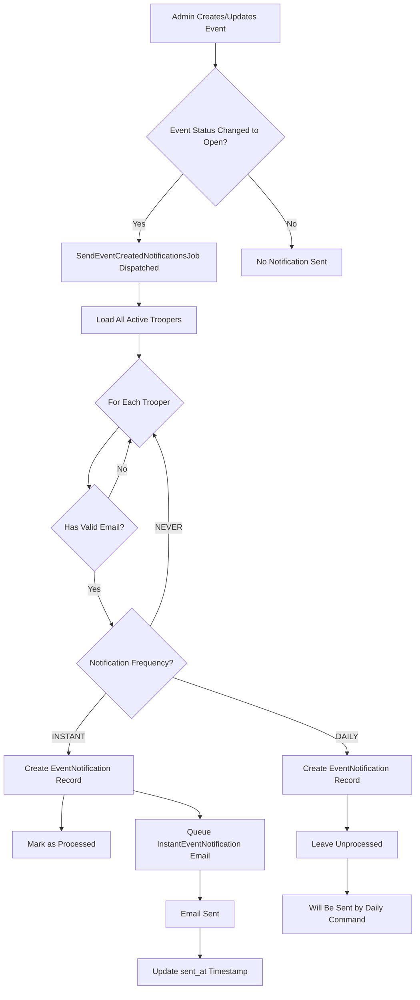
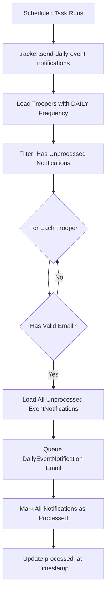
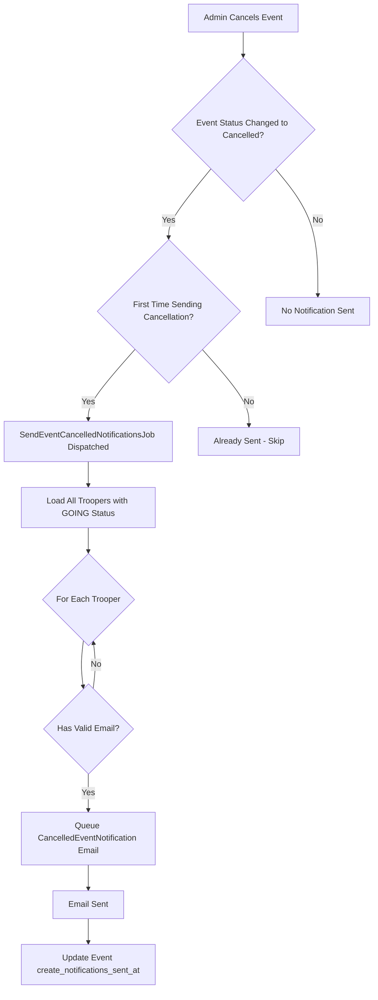

# Event Notifications

This document describes how the Troop Tracker application manages and sends event notifications to troopers.

## Overview

The notification system informs troopers about new events and event cancellations based on their individual preferences. Troopers can choose to receive notifications **instantly**, in a **daily digest**, or **never**.

## Notification Frequencies

Troopers can configure their notification preferences through their profile settings. The system supports three notification frequencies:

- **`NEVER`** - The trooper will not receive any event notifications
- **`INSTANT`** - The trooper receives an email immediately when an event is created
- **`DAILY`** - The trooper receives a daily digest email containing all new events posted since their last notification

## Event Created Notifications

### Workflow



### SendEventCreatedNotificationsJob

**Triggered When:** An event's status changes to "open" (published)

**Purpose:** Creates notification records for all active troopers and sends instant emails to those with instant notification preferences.

**Process:**
1. Loads all active troopers who haven't opted out of notifications (`notification_frequency != NEVER`)
2. Checks for existing notifications to prevent duplicates
3. For each eligible trooper:
   - Validates their email address
   - Creates an `EventNotification` record
   - **If notification_frequency is INSTANT:**
     - Marks notification as processed immediately
     - Queues instant email via `InstantEventNotification` mailable
   - **If notification_frequency is DAILY:**
     - Leaves notification unprocessed
     - Will be picked up by the daily notification command

**Key Models:**
- `Event` - The event being notified about
- `EventNotification` - Tracks which troopers have been notified about which events
- `Trooper` - Active troopers with valid email addresses

## Daily Event Notification Command

### Workflow



### SendDailyEventNotifications Command

**Triggered When:** Scheduled task runs (typically once per day)

**Command:** `php artisan tracker:send-daily-event-notifications`

**Purpose:** Sends a digest email containing all unprocessed event notifications to troopers who prefer daily notifications.

**Process:**
1. Queries all active troopers with `notification_frequency = DAILY`
2. Filters to only those with unprocessed notifications (`processed_at IS NULL`)
3. For each eligible trooper:
   - Validates their email address
   - Loads all their unprocessed `EventNotification` records
   - Queues a single digest email via `DailyEventNotification` mailable
   - Marks all notifications as processed

**Scheduling:**
This command should be scheduled in `app/Console/Kernel.php` to run at the desired time each day.

## Event Cancelled Notifications

### Workflow



### SendEventCancelledNotificationsJob

**Triggered When:** An event's status changes to "cancelled"

**Purpose:** Notifies all troopers who signed up for the cancelled event.

**Process:**
1. Checks if cancellation notifications have already been sent (via `create_notifications_sent_at`)
2. Queries all active troopers with `GOING` status for any shift in the event
3. For each trooper:
   - Validates their email address
   - Queues cancellation email via `CancelledEventNotification` mailable
4. Updates event's `create_notifications_sent_at` timestamp to prevent duplicate sends

**Important Notes:**
- Cancellation notifications are sent **regardless of notification frequency**
- This ensures troopers who committed to an event are always notified of cancellations
- The notification is sent only once per event

## Email Templates

### InstantEventNotification
- **Subject:** "Troop Tracker - New Event Posted"
- **Template:** `emails.events.instant-event-notification`
- **Data:** Single event with all shifts
- **Tracks:** `sent_at` timestamp on `EventNotification` record

### DailyEventNotification
- **Subject:** "Troop Tracker - New Event Posted" 
- **Template:** `emails.events.daily-event-notification`
- **Data:** Collection of multiple events posted since last digest
- **Tracks:** `sent_at` timestamp on each `EventNotification` record

### CancelledEventNotification
- **Subject:** "Troop Tracker - Event Cancelled"
- **Template:** `emails.events.cancelled-event-notification`
- **Data:** Cancelled event details
- **Tracks:** Via event's `create_notifications_sent_at` timestamp

## Database Schema

### EventNotification Table

Tracks which troopers have been notified about which events.

| Column | Type | Description |
|--------|------|-------------|
| `id` | int | Primary key |
| `event_id` | int | Foreign key to events table |
| `trooper_id` | int | Foreign key to troopers table |
| `processed_at` | timestamp | When notification was processed (NULL for pending daily notifications) |
| `sent_at` | timestamp | When email was successfully sent |
| `created_at` | timestamp | Record creation time |
| `updated_at` | timestamp | Record update time |

### Event Table (Notification Fields)

| Column | Type | Description |
|--------|------|-------------|
| `create_notifications_sent_at` | timestamp | When creation/cancellation notifications were sent |

## Implementation Details

### Email Validation

All notification jobs validate trooper email addresses using:

```php
$trooper->emailAppearsValid()
```

This method checks that:
- The email field is not empty
- The email passes PHP's `filter_var($email, FILTER_VALIDATE_EMAIL)` validation

### Preventing Duplicate Notifications

**For Event Created:**
- Checks existing `EventNotification` records before creating new ones
- Prevents re-notifying troopers who already have a notification for the event

**For Event Cancelled:**
- Uses event's `create_notifications_sent_at` timestamp
- Job returns early if timestamp is already set

### Queue System

All notification emails implement `ShouldQueue` and are processed asynchronously:
- Prevents blocking HTTP requests
- Handles temporary email delivery failures
- Allows for retry logic on failures

## Best Practices

1. **Always validate email addresses** before sending notifications
2. **Use queued jobs** for all email sending to prevent timeouts
3. **Track notification state** to prevent duplicate sends
4. **Respect trooper preferences** - never override `NEVER` setting except for cancellations
5. **Log notification failures** for debugging and trooper support

## Troubleshooting

### Troopers Not Receiving Notifications

1. Check trooper's `notification_frequency` setting
2. Verify trooper's `membership_status` is `ACTIVE`
3. Validate email address format
4. Check queue worker is processing jobs
5. Review mail server logs for delivery issues

### Duplicate Notifications

1. Verify `EventNotification` records aren't being created multiple times
2. Check event's `create_notifications_sent_at` for cancellation notifications
3. Ensure jobs aren't being dispatched multiple times on event updates

### Daily Notifications Not Sending

1. Verify scheduled task is configured and running
2. Check for troopers with `notification_frequency = DAILY`
3. Confirm unprocessed `EventNotification` records exist
4. Review command output and logs

## Future Enhancements

Potential improvements to the notification system:

- **Weekly digest option** for less frequent notifications
- **Organization-specific notifications** (only notify about events for trooper's organizations)
- **Event type filters** (trooper chooses which types of events to be notified about)
- **SMS/Push notifications** as alternatives to email
- **Notification history** dashboard for troopers to review past notifications
