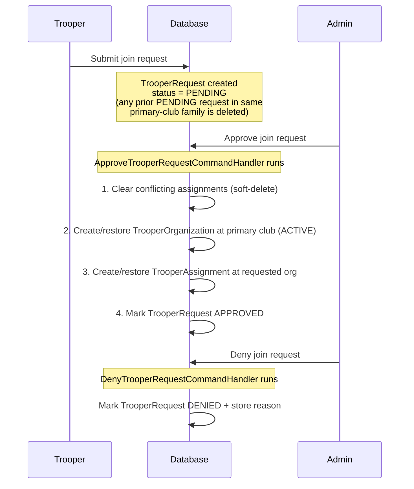

# Club Memberships and Join Requests

This document explains how club join requests and trooper-organization memberships work in code — including the two-table model, what each table represents, how approval wires them together, and how the membership page determines which club a trooper belongs to.

---

## Data Model

Three tables track a trooper's relationship with organizations:

| Table | Model | Purpose |
|---|---|---|
| `tt_trooper_requests` | `TrooperRequest` | Pending/resolved request — "this trooper asked to join this org" |
| `tt_trooper_organizations` | `TrooperOrganization` | Formal membership record — "this trooper is a member of this primary club" |
| `tt_trooper_assignments` | `TrooperAssignment` | Active assignment — "this is the specific org (or sub-org) the trooper is actively placed in" |

All three use soft-deletes (`deleted_at`). The distinction matters:

- `tt_trooper_requests` is the source of truth for pending/resolved requests. A `TrooperOrganization` is created only on approval.
- A trooper can have a `TrooperOrganization` for a primary club without an active `TrooperAssignment` (historical record, membership removed).
- The `is_member` display on the membership page requires **both** `TrooperOrganization` and `TrooperAssignment` to be present.

### Key Columns

**`tt_trooper_requests`**

| Column | Purpose |
|---|---|
| `trooper_id` | FK to trooper |
| `organization_id` | The org the trooper requested to join (any depth) |
| `primary_organization_id` | Top-level ancestor; denormalized at submit time via `getPrimaryClub()` |
| `identifier` | Optional club-specific ID submitted with the request (e.g. TK number) |
| `status` | `pending`, `approved`, `denied` |

**`tt_trooper_organizations`**

| Column | Purpose |
|---|---|
| `trooper_id` | FK to trooper |
| `organization_id` | FK to organization |
| `membership_status` | `active`, `retired` (created as `active` on approval; `pending` state is tracked in `tt_trooper_requests`) |
| `identifier` | Trooper's ID within that org (e.g. TK number) |
| `deleted_at` | Soft-delete; non-null = membership removed |

**`tt_trooper_assignments`**

| Column | Purpose |
|---|---|
| `trooper_id` | FK to trooper |
| `organization_id` | FK to organization (any level: club, region, or unit) |
| `is_member` | `true` = active placement in this org |
| `is_moderator` | `true` = has moderation scope here |
| `deleted_at` | Soft-delete; non-null = assignment cleared |

---

## Organization Hierarchy and `node_path`

Organizations form a tree. Each node carries a `node_path` (e.g. `100:`, `100:200:`, `100:200:300:`) that encodes the full path from the root. This is used throughout assignment queries.

```
Galactic Academy          node_path: 100:          (primary club / "organization")
└── North America Campus  node_path: 100:200:      (region)
    └── Florida Unit      node_path: 100:200:300:  (unit)
```

The **primary club** for any org is the top-level ancestor (the `organization` type). `Organization::getPrimaryClub()` walks up the tree to find it.

---

## Join Request Lifecycle

A join request is a `TrooperRequest` record in `tt_trooper_requests`. Submitting a request does **not** create a `TrooperOrganization` — that record is created (or restored) only on approval, always scoped to the primary club.



### Step-by-Step: `ApproveTrooperRequestCommandHandler`

**File:** `app/Features/Troopers/Commands/ApproveTrooperRequestCommandHandler.php`

```
__invoke()
├── Resolve primary_club = trooper_request->primaryOrganization  (denormalized; no tree traversal needed)
├── clearExistingAssignments(primary_club, trooper_request)
├── createOrUpdateMembership(primary_club, trooper_request)   → TrooperOrganization at primary club, status = ACTIVE
├── createOrUpdateAssignment(requested_org.id, trooper.id) → TrooperAssignment at the requested org
├── trooper_request->status = APPROVED, save
└── notify trooper (unless suppress_notification = true)
```

#### `clearExistingAssignments`

Enforces the **replace rule**: a trooper can only have one active assignment in a given club hierarchy at a time.

Takes `Organization $primary_club` and `TrooperRequest $trooper_request` (reads `trooper_id` and `organization_id` from the request).

1. Plucks IDs of all `TrooperAssignment` records where:
   - `is_member = true`
   - organization is **not** the newly-joined org
   - organization is in the same hierarchy as the primary club (bidirectional — catches both ancestors and descendants using `node_path`)
2. Sets `is_member = false` on those records (for data readability in raw DB views).
3. Soft-deletes those records.

Mass updates (`->update()`, `->delete()`) bypass the `TrooperAssignmentObserver`, which is intentional — the observer enforces constraints on new saves, not on clearing old data.

#### `createOrUpdateMembership`

Creates or restores a `TrooperOrganization` at the **primary club** (always the depth-0 ancestor, regardless of which sub-org was requested):

1. Queries `withTrashed()` for an existing record matching `(trooper_id, primary_club.id)`.
2. If found and trashed → restores it.
3. Updates `membership_status = ACTIVE` and syncs the identifier from the join request if provided.
4. If not found → creates a new `TrooperOrganization`.

#### `createOrUpdateAssignment`

Creates or restores the `TrooperAssignment` at the **requested org** (the specific unit, region, or club the trooper asked to join):

1. Queries `withTrashed()` for an existing record matching `(trooper_id, organization_id)`.
2. If found and trashed → restores it, then sets `is_member = true`, saves.
3. If found and not trashed → sets `is_member = true`, saves.
4. If not found → creates a new record with `is_member = true`.

The individual `->save()` call here **does** fire `TrooperAssignmentObserver.saving()`. For visitors, the observer enforces that assignments can only be to top-level orgs (depth ≤ 1).

---

## Denial

`DenyTrooperRequestCommandHandler` sets `status = DENIED`, records `denial_reason`, and sends `JoinRequestDeniedNotification` to the trooper. No `TrooperOrganization` or `TrooperAssignment` records are created or modified.

---

## Determining Which Club a Trooper Belongs To

**File:** `app/Features/Troopers/Queries/GetTrooperMembershipsQueryHandler.php`

The admin membership page (`/admin/troopers/{id}/membership`) shows all top-level organizations with one row each. For each org the handler computes:

| Property | Source | Meaning |
|---|---|---|
| `is_member` | Both tables (see below) | Controls whether the red X "remove" button appears |
| `identifier` | `TrooperOrganization.identifier` | TK number for that club |
| `membership_status` | `TrooperOrganization.membership_status` | Active / pending / retired |
| `assignment` | `TrooperAssignment.organization` | The specific org (unit/region/club) the trooper is placed in |

### The `is_member` Rule

```php
$organization->is_member = $trooper_organization !== null && $assignment_org !== null;
```

**Both** must be true:

1. A non-soft-deleted `TrooperOrganization` exists for this top-level org.
2. An active (`is_member = true`, non-soft-deleted) `TrooperAssignment` exists anywhere in this org's hierarchy.

This means a trooper with a historical `TrooperOrganization` but no current active assignment (e.g. their membership was removed) will **not** show the remove button — the stale record is invisible to the display.

### Finding the Assignment Org

The `assignment` property shows the most specific org within the hierarchy that has an active assignment. It's found by checking whether the assignment's `node_path` starts with the top-level org's `node_path`:

```php
if (str_starts_with($assignment->organization->node_path, $organization->node_path)) {
    $assignment_org = $assignment->organization;
}
```

Example: A trooper assigned to `Florida Unit` (`100:200:300:`) shows up under `Galactic Academy` (`100:`) because `100:200:300:` starts with `100:`.

---

## Removing Membership (Red X Button)

**File:** `app/Features/Troopers/Commands/RemoveTrooperMembershipCommandHandler.php`

Clicking the red X on a primary club row runs:

1. **Soft-deletes the `TrooperOrganization`** for that top-level org.
2. **Clears assignments** in the entire hierarchy below that org:
   - Plucks IDs of `TrooperAssignment` records with `is_member = true` in the hierarchy.
   - Sets `is_member = false` on those records.
   - Soft-deletes those records.

After removal, neither the `TrooperOrganization` nor the `TrooperAssignment` is visible to normal queries. The red X disappears from the membership page.

---

## Updating the Assignment (Membership Form)

**File:** `app/Features/Troopers/Commands/UpdateTrooperMembershipsCommandHandler.php`

When an admin submits the membership form to change the "Member of" picker (i.e. move a trooper from one unit to another within a club):

1. **Soft-deletes conflicting assignments** in the same hierarchy (bidirectional — catches both ancestor and descendant orgs), excluding the newly-selected org.
2. **Restores or creates** the assignment at the selected org with `is_member = true`.

This is the canonical write path for manually setting which unit a trooper belongs to.

---

## The Replace Rule

All write paths enforce a single-assignment-per-hierarchy constraint:

> A trooper may have at most one active (`is_member = true`, non-soft-deleted) `TrooperAssignment` within any given primary-club hierarchy.

This is enforced in two places:

| Where | How |
|---|---|
| `TrooperAssignmentObserver.saving()` | Throws if a new/updated assignment conflicts with an existing active one in the same hierarchy. Fires on individual model saves only — not mass updates. |
| `clearExistingAssignments` / `UpdateTrooperMembershipsCommandHandler` | Proactively soft-deletes conflicting assignments before creating the new one, so the observer never sees a conflict. |

---

## Visitor Restrictions

Visitors (`membership_role = visitor`) have an additional constraint enforced by `TrooperAssignmentObserver.saving()`:

```php
if ($trooper_assignment->trooper->is_visitor) {
    if ($organization && $organization->depth > 1) {
        throw new Exception('Visitors can only join top-level organizations.');
    }
}
```

Visitors can only be assigned to organizations at `depth 0` (primary clubs). The approval and assignment flows are identical for visitors and members — the restriction is enforced at the observer level when `->save()` is called on an individual model.

---

## Key Code References

| Concern | Path |
|---|---|
| Submit join request | `app/Features/Troopers/Commands/SubmitTrooperRequestCommandHandler.php` |
| Approve join request | `app/Features/Troopers/Commands/ApproveTrooperRequestCommandHandler.php` |
| Deny join request | `app/Features/Troopers/Commands/DenyTrooperRequestCommandHandler.php` |
| Remove membership | `app/Features/Troopers/Commands/RemoveTrooperMembershipCommandHandler.php` |
| Update assignment picker | `app/Features/Troopers/Commands/UpdateTrooperMembershipsCommandHandler.php` |
| Direct admin add | `app/Features/Troopers/Commands/DirectAddTrooperCommandHandler.php` |
| Membership page query | `app/Features/Troopers/Queries/GetTrooperMembershipsQueryHandler.php` |
| Assignment observer | `app/Models/Observers/TrooperAssignmentObserver.php` |
| Membership page view | `resources/views/pages/admin/troopers/membership.blade.php` |
| TrooperRequest model | `app/Models/TrooperRequest.php` |
| Organization model | `app/Models/Organization.php` |
| TrooperAssignment model | `app/Models/TrooperAssignment.php` |
| TrooperOrganization model | `app/Models/TrooperOrganization.php` |
