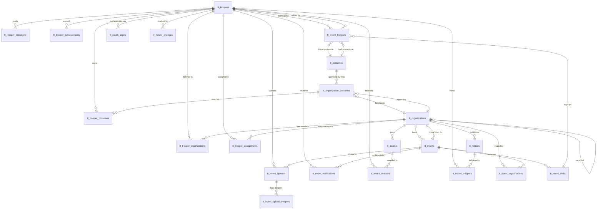

# Database Schema

Schema reference for Troop Tracker's MySQL database.

**Key Entities:**
- Troopers (members), Organizations (clubs/garrisons/squads), Events (troops/appearances)
- Costumes, Awards, Achievements, Notices, Notifications
- OAuth authentication, Photo uploads, Audit trails

All tables use `tt_` prefix with `snake_case` naming, soft deletes, and timestamps.

---

## Entity Relationship Diagram



---

## Table Definitions

### Core Tables

#### `tt_troopers`

The authenticated member entity. Stores user accounts for members of the costuming organization.

| Column | Type | Constraints | Description |
|--------|------|-------------|-------------|
| `id` | bigint unsigned | PK, auto-increment | Primary key |
| `display_name` | varchar(128) | NOT NULL | Trooper's display name |
| `legal_name` | varchar(128) | NOT NULL | Trooper's legal name |
| `phone` | varchar(32) | nullable | Contact phone number |
| `email` | varchar(256) | unique, NOT NULL | Email address for authentication |
| `email_verified_at` | timestamp | nullable | Email verification timestamp |
| `setup_completed_at` | datetime | nullable | Account setup completion timestamp |
| `password` | varchar(256) | NOT NULL | Hashed password |
| `theme` | varchar(16) | default: 'stormtrooper' | UI theme preference |
| `membership_status` | varchar(16) | default: 'pending' | Enum: pending, active, retired |
| `membership_role` | varchar(16) | default: 'member' | Enum: member, moderator, administrator |
| `notification_frequency` | varchar(16) | default: 'never' | Enum: never, instant, daily |
| `achievements_updated_at` | datetime | nullable | Last achievement update |
| `last_active_at` | datetime | nullable | Last activity timestamp |
| `remember_token` | varchar(100) | nullable | Laravel remember token |
| `created_at` | timestamp | nullable | Record creation time |
| `updated_at` | timestamp | nullable | Record update time |
| `deleted_at` | timestamp | nullable | Soft delete timestamp |

**Indexes:**
- Unique on `email`

**Notes:**
- Central authentication entity
- References to "User" in the codebase actually refer to Trooper
- Membership status controls access levels

---

#### `tt_organizations`

Hierarchical structure for clubs, garrisons, and squads (Organizations → Regions → Units in code).

| Column | Type | Constraints | Description |
|--------|------|-------------|-------------|
| `id` | bigint unsigned | PK, auto-increment | Primary key |
| `parent_id` | bigint unsigned | FK to tt_organizations, nullable | Self-referencing parent organization |
| `name` | varchar(64) | NOT NULL | Organization name |
| `type` | varchar(16) | NOT NULL | Enum: club, garrison, squad |
| `depth` | integer | default: 0 | Tree depth level |
| `sequence` | integer | default: 0 | Sort order |
| `node_path` | varchar(128) | default: '' | Materialized path for tree queries |
| `identifier_display` | varchar(64) | nullable | Display format for member IDs (e.g., TK-12345) |
| `identifier_validation` | varchar(64) | nullable | Regex for ID validation |
| `image_path_lg` | varchar(128) | nullable | Large logo image path |
| `image_path_sm` | varchar(128) | nullable | Small logo image path |
| `service_class` | varchar(128) | nullable | Integration service class name |
| `sync_sheet_id` | varchar(128) | nullable | Google Sheet ID for sync |
| `discord_mention` | varchar(128) | nullable | Discord mention identifier for this org |
| `related_forum` | bigint unsigned | nullable | XenForo forum node ID for event threads |
| `related_forum_archive` | bigint unsigned | nullable | XenForo forum node ID for archived threads |
| `xenforo_group_active_id` | bigint unsigned | nullable | XenForo user group ID for active members |
| `xenforo_group_reserve_id` | bigint unsigned | nullable | XenForo user group ID for reserve members |
| `xenforo_group_retired_id` | bigint unsigned | nullable | XenForo user group ID for retired members |
| `synchronized_at` | datetime | nullable | Last synchronization timestamp with external systems |
| `description` | varchar(512) | nullable | Organization description |
| `created_at` | timestamp | nullable | Record creation time |
| `updated_at` | timestamp | nullable | Record update time |
| `deleted_at` | timestamp | nullable | Soft delete timestamp |
| `created_id` | bigint unsigned | nullable | ID of trooper who created |
| `updated_id` | bigint unsigned | nullable | ID of trooper who last updated |
| `deleted_id` | bigint unsigned | nullable | ID of trooper who deleted |

**Indexes:**
- Unique on `(parent_id, name)`

**Foreign Keys:**
- `parent_id` → `tt_organizations.id` (CASCADE on delete)

**Notes:**
- Self-referencing tree structure
- `depth` and `node_path` enable efficient tree queries
- Organizations can host events and approve costumes

---

#### `tt_costumes`

Base costume definitions (character types, not individual trooper costumes).

| Column | Type | Constraints | Description |
|--------|------|-------------|-------------|
| `id` | bigint unsigned | PK, auto-increment | Primary key |
| `name` | varchar(128) | unique, NOT NULL | Costume name (e.g., "Stormtrooper TK") |
| `created_at` | timestamp | nullable | Record creation time |
| `updated_at` | timestamp | nullable | Record update time |
| `deleted_at` | timestamp | nullable | Soft delete timestamp |
| `created_id` | bigint unsigned | nullable | ID of trooper who created |
| `updated_id` | bigint unsigned | nullable | ID of trooper who last updated |
| `deleted_id` | bigint unsigned | nullable | ID of trooper who deleted |

**Indexes:**
- Unique on `name`

**Notes:**
- Represents costume types/categories globally
- Organizations approve these via `tt_organization_costumes`

---

#### `tt_organization_costumes`

Organization-approved costumes with optional prefix identifiers.

| Column | Type | Constraints | Description |
|--------|------|-------------|-------------|
| `id` | bigint unsigned | PK, auto-increment | Primary key |
| `organization_id` | bigint unsigned | FK to tt_organizations, NOT NULL | Organization that approved costume |
| `costume_id` | bigint unsigned | FK to tt_costumes, NOT NULL | Costume being approved |
| `prefix` | varchar(8) | nullable | Organization costume prefix (e.g., "TK") |
| `synchronized_at` | datetime | nullable | Last synchronization timestamp |
| `created_at` | timestamp | nullable | Record creation time |
| `updated_at` | timestamp | nullable | Record update time |
| `deleted_at` | timestamp | nullable | Soft delete timestamp |
| `created_id` | bigint unsigned | nullable | ID of trooper who created |
| `updated_id` | bigint unsigned | nullable | ID of trooper who last updated |
| `deleted_id` | bigint unsigned | nullable | ID of trooper who deleted |

**Indexes:**
- Unique on `(organization_id, costume_id)`

**Foreign Keys:**
- `organization_id` → `tt_organizations.id` (CASCADE on delete)
- `costume_id` → `tt_costumes.id` (CASCADE on delete)

**Notes:**
- Links base costumes to organizations
- Troopers link to these via `tt_trooper_costumes`

---

### Trooper Relationships

#### `tt_trooper_organizations`

Links troopers to organizations with their member ID and verification status.

| Column | Type | Constraints | Description |
|--------|------|-------------|-------------|
| `id` | bigint unsigned | PK, auto-increment | Primary key |
| `trooper_id` | bigint unsigned | FK to tt_troopers, NOT NULL | Trooper being linked |
| `organization_id` | bigint unsigned | FK to tt_organizations, NOT NULL | Organization trooper belongs to |
| `identifier` | varchar(64) | NOT NULL | Member ID (e.g., "TK-12345") |
| `membership_status` | varchar(16) | default: 'pending' | Enum: pending, active, retired |
| `synchronized_at` | datetime | nullable | Last synchronization timestamp |
| `created_at` | timestamp | nullable | Record creation time |
| `updated_at` | timestamp | nullable | Record update time |
| `deleted_at` | timestamp | nullable | Soft delete timestamp |
| `created_id` | bigint unsigned | nullable | ID of trooper who created |
| `updated_id` | bigint unsigned | nullable | ID of trooper who last updated |
| `deleted_id` | bigint unsigned | nullable | ID of trooper who deleted |

**Indexes:**
- Unique on `(trooper_id, organization_id)`
- Unique on `(organization_id, identifier)`

**Foreign Keys:**
- `trooper_id` → `tt_troopers.id` (CASCADE on delete)
- `organization_id` → `tt_organizations.id` (CASCADE on delete)

**Notes:**
- Pivot table with extra attributes
- `identifier` must be unique within an organization
- Tracks membership verification status

---

#### `tt_trooper_assignments`

Defines administrative relationships between troopers and organizations (notifications, moderation).

| Column | Type | Constraints | Description |
|--------|------|-------------|-------------|
| `id` | bigint unsigned | PK, auto-increment | Primary key |
| `trooper_id` | bigint unsigned | FK to tt_troopers, NOT NULL | Trooper assigned |
| `organization_id` | bigint unsigned | FK to tt_organizations, NOT NULL | Organization assignment |
| `should_notify` | boolean | default: false | Should receive notifications from this org |
| `is_member` | boolean | default: false | Is a member of this org |
| `is_moderator` | boolean | default: false | Has moderation privileges |
| `created_at` | timestamp | nullable | Record creation time |
| `updated_at` | timestamp | nullable | Record update time |
| `deleted_at` | timestamp | nullable | Soft delete timestamp |
| `created_id` | bigint unsigned | nullable | ID of trooper who created |
| `updated_id` | bigint unsigned | nullable | ID of trooper who last updated |
| `deleted_id` | bigint unsigned | nullable | ID of trooper who deleted |

**Indexes:**
- Unique on `(trooper_id, organization_id)`

**Foreign Keys:**
- `trooper_id` → `tt_troopers.id` (CASCADE on delete)
- `organization_id` → `tt_organizations.id` (CASCADE on delete)

**Notes:**
- Distinct from `tt_trooper_organizations` (membership vs. privileges)
- Controls notification and moderation permissions

---

#### `tt_trooper_costumes`

Links troopers to the costumes they own/wear.

| Column | Type | Constraints | Description |
|--------|------|-------------|-------------|
| `id` | bigint unsigned | PK, auto-increment | Primary key |
| `trooper_id` | bigint unsigned | FK to tt_troopers, NOT NULL | Trooper who owns costume |
| `organization_costume_id` | bigint unsigned | FK to tt_organization_costumes, NOT NULL | Organization costume owned |
| `image_url_sm` | varchar(128) | nullable | Small costume image URL |
| `image_url_lg` | varchar(128) | nullable | Large costume image URL |
| `image_url_bucket_off` | varchar(128) | nullable | Bucket-off image URL |
| `synchronized_at` | datetime | nullable | Last synchronization timestamp |
| `created_at` | timestamp | nullable | Record creation time |
| `updated_at` | timestamp | nullable | Record update time |
| `deleted_at` | timestamp | nullable | Soft delete timestamp |
| `created_id` | bigint unsigned | nullable | ID of trooper who created |
| `updated_id` | bigint unsigned | nullable | ID of trooper who last updated |
| `deleted_id` | bigint unsigned | nullable | ID of trooper who deleted |

**Indexes:**
- Unique on `(trooper_id, organization_costume_id)`

**Foreign Keys:**
- `trooper_id` → `tt_troopers.id` (CASCADE on delete)
- `organization_costume_id` → `tt_organization_costumes.id` (CASCADE on delete)

**Notes:**
- Many-to-many relationship between troopers and organization costumes
- Tracks which costumes a trooper can wear to events
- Photos stored via URLs

---

#### `tt_trooper_donations`

Tracks financial donations made by troopers.

| Column | Type | Constraints | Description |
|--------|------|-------------|-------------|
| `id` | bigint unsigned | PK, auto-increment | Primary key |
| `trooper_id` | bigint unsigned | FK to tt_troopers, NOT NULL | Trooper who donated |
| `amount` | decimal(11) | NOT NULL | Donation amount |
| `txn_id` | varchar(128) | unique, NOT NULL | Transaction ID |
| `txn_type` | varchar(128) | default: '' | Transaction type/method |
| `created_at` | timestamp | nullable | Record creation time |
| `updated_at` | timestamp | nullable | Record update time |
| `deleted_at` | timestamp | nullable | Soft delete timestamp |
| `created_id` | bigint unsigned | nullable | ID of trooper who created |
| `updated_id` | bigint unsigned | nullable | ID of trooper who last updated |
| `deleted_id` | bigint unsigned | nullable | ID of trooper who deleted |

**Indexes:**
- Unique on `txn_id`

**Foreign Keys:**
- `trooper_id` → `tt_troopers.id` (CASCADE on delete)

**Notes:**
- Tracks donations separate from event charity tracking
- `txn_id` prevents duplicate recording

---

#### `tt_trooper_achievements`

Tracks trooper milestones, badges, and statistics.

| Column | Type | Constraints | Description |
|--------|------|-------------|-------------|
| `id` | bigint unsigned | PK, auto-increment | Primary key |
| `trooper_id` | bigint unsigned | FK to tt_troopers, NOT NULL | Trooper's achievements |
| `type` | varchar(64) | NOT NULL | Achievement type identifier |
| `value` | varchar(64) | nullable | Achievement value/count |
| `earned_on` | date | nullable | Date achievement was earned |
| `created_at` | timestamp | nullable | Record creation time |
| `updated_at` | timestamp | nullable | Record update time |
| `deleted_at` | timestamp | nullable | Soft delete timestamp |

**Indexes:**
- Unique on `(trooper_id, type)`

**Foreign Keys:**
- `trooper_id` → `tt_troopers.id` (CASCADE on delete)

**Notes:**
- Flexible key-value Achievement storage
- Type identifies which achievement (e.g., "trooped_50", "first_troop")
- Automatically updated by event participation

---

### Event Management

#### `tt_events`

Core event (troop/appearance) table.

| Column | Type | Constraints | Description |
|--------|------|-------------|-------------|
| `id` | bigint unsigned | PK, auto-increment | Primary key |
| `organization_id` | bigint unsigned | FK to tt_organizations, NOT NULL | Hosting organization |
| `primary_organization_id` | bigint unsigned | FK to tt_organizations, NOT NULL | Primary organization/club |
| `name` | varchar(256) | NOT NULL | Event name |
| `type` | varchar(16) | default: 'regular' | Enum: regular, special, fundraiser |
| `status` | varchar(16) | default: 'draft' | Enum: draft, open, closed, cancelled |
| `create_notifications_sent_at` | datetime | nullable | When creation notifications were sent |
| `cancel_notifications_sent_at` | datetime | nullable | When cancellation notifications were sent |
| `create_forum_thread` | boolean | default: true | Auto-create linked forum thread |
| `thread_id` | integer | nullable | Linked forum thread ID |
| `post_id` | integer | nullable | Linked forum post ID |
| `latitude` | decimal(9,6) | nullable | Event location latitude |
| `longitude` | decimal(9,6) | nullable | Event location longitude |
| `shifts_allowed` | integer | nullable | Max shifts allowed |
| `troopers_allowed` | integer | nullable | Max troopers per shift |
| `handlers_allowed` | integer | nullable | Max handlers allowed |
| `friends_allowed` | integer | nullable | Max friends/family allowed |
| `tentative_signups_allowed` | boolean | default: false | Allow tentative RSVPs |
| `charity_direct_funds` | integer | default: 0 | Direct charity funds raised |
| `charity_indirect_funds` | integer | default: 0 | Indirect charity funds raised |
| `charity_name` | varchar(128) | nullable | Charity beneficiary name |
| `charity_hours` | integer | nullable | Total charity volunteer hours |
| `charity_notes` | text | nullable | Additional charity notes |
| `contact_name` | varchar(128) | nullable | Event contact person |
| `contact_phone` | varchar(128) | nullable | Event contact phone |
| `contact_email` | varchar(128) | nullable | Event contact email |
| `venue` | varchar(256) | nullable | Venue name |
| `venue_address` | varchar(256) | nullable | Street address |
| `venue_city` | varchar(128) | nullable | City |
| `venue_state` | varchar(128) | nullable | State/province |
| `venue_zip` | varchar(128) | nullable | Postal code |
| `venue_country` | varchar(128) | nullable | Country |
| `event_start` | datetime | nullable | Event start time |
| `event_end` | datetime | nullable | Event end time |
| `event_website` | varchar(512) | nullable | Event website URL |
| `expected_attendees` | integer | nullable | Expected public attendees |
| `requested_number_characters` | integer | nullable | Requested number of costumers |
| `requested_character_types` | text | nullable | Requested costume types |
| `secure_staging_area` | boolean | default: false | Has secure changing area |
| `allow_blasters` | boolean | default: false | Blasters permitted |
| `allow_props` | boolean | default: false | Props permitted |
| `parking_available` | boolean | default: false | Parking available |
| `accessible` | boolean | default: false | ADA accessible |
| `amenities` | text | nullable | Additional amenities |
| `referred_by` | varchar(1024) | nullable | Referral source |
| `source` | text | nullable | Event source/origin |
| `comments` | text | nullable | Additional comments |
| `created_at` | timestamp | nullable | Record creation time |
| `updated_at` | timestamp | nullable | Record update time |
| `deleted_at` | timestamp | nullable | Soft delete timestamp |
| `created_id` | bigint unsigned | nullable | ID of trooper who created |
| `updated_id` | bigint unsigned | nullable | ID of trooper who last updated |
| `deleted_id` | bigint unsigned | nullable | ID of trooper who deleted |

**Foreign Keys:**
- `organization_id` → `tt_organizations.id` (CASCADE on delete)
- `primary_organization_id` → `tt_organizations.id` (CASCADE on delete)

**Notes:**
- Events have multiple shifts (see `tt_event_shifts`)
- Comprehensive event request and venue tracking
- Charity tracking fields for fundraising events
- Notification timestamps prevent duplicate sends

---

#### `tt_event_shifts`

Time-based shifts within an event.

| Column | Type | Constraints | Description |
|--------|------|-------------|-------------|
| `id` | bigint unsigned | PK, auto-increment | Primary key |
| `event_id` | bigint unsigned | FK to tt_events, NOT NULL | Parent event |
| `status` | varchar(16) | default: 'draft' | Enum: draft, open, closed, cancelled |
| `shift_starts_at` | datetime | NOT NULL | Shift start time |
| `shift_ends_at` | datetime | NOT NULL | Shift end time |
| `created_at` | timestamp | nullable | Record creation time |
| `updated_at` | timestamp | nullable | Record update time |
| `deleted_at` | timestamp | nullable | Soft delete timestamp |
| `created_id` | bigint unsigned | nullable | ID of trooper who created |
| `updated_id` | bigint unsigned | nullable | ID of trooper who last updated |
| `deleted_id` | bigint unsigned | nullable | ID of trooper who deleted |

**Indexes:**
- Unique on `(event_id, shift_starts_at)`

**Foreign Keys:**
- `event_id` → `tt_events.id` (CASCADE on delete)

**Notes:**
- Prevents duplicate shifts at the same time
- Shift status can differ from parent event status

---

#### `tt_event_organizations`

Defines which organizations are invited to an event and their participation limits.

| Column | Type | Constraints | Description |
|--------|------|-------------|-------------|
| `id` | bigint unsigned | PK, auto-increment | Primary key |
| `event_id` | bigint unsigned | FK to tt_events, NOT NULL | Event being configured |
| `organization_id` | bigint unsigned | FK to tt_organizations, NOT NULL | Invited organization |
| `can_attend` | boolean | default: true | Organization is allowed to attend |
| `troopers_allowed` | integer | nullable | Max troopers from this org |
| `handlers_allowed` | integer | nullable | Max handlers from this org |
| `created_at` | timestamp | nullable | Record creation time |
| `updated_at` | timestamp | nullable | Record update time |
| `deleted_at` | timestamp | nullable | Soft delete timestamp |
| `created_id` | bigint unsigned | nullable | ID of trooper who created |
| `updated_id` | bigint unsigned | nullable | ID of trooper who last updated |
| `deleted_id` | bigint unsigned | nullable | ID of trooper who deleted |

**Indexes:**
- Unique on `(event_id, organization_id)`

**Foreign Keys:**
- `event_id` → `tt_events.id` (CASCADE on delete)
- `organization_id` → `tt_organizations.id` (CASCADE on delete)

**Notes:**
- Controls cross-organization event participation
- Allows per-organization attendance caps

---

#### `tt_event_troopers`

Trooper signups for event shifts.

| Column | Type | Constraints | Description |
|--------|------|-------------|-------------|
| `id` | bigint unsigned | PK, auto-increment | Primary key |
| `event_shift_id` | bigint unsigned | FK to tt_event_shifts, NOT NULL | Shift being signed up for |
| `trooper_id` | bigint unsigned | FK to tt_troopers, NOT NULL | Trooper signing up |
| `costume_id` | bigint unsigned | FK to tt_costumes, nullable | Primary costume choice |
| `costume_organization_ids` | json | nullable | Array of organization IDs for primary costume |
| `backup_costume_id` | bigint unsigned | FK to tt_costumes, nullable | Backup costume choice |
| `backup_costume_organization_ids` | json | nullable | Array of organization IDs for backup costume |
| `added_by_trooper_id` | bigint unsigned | FK to tt_troopers, nullable | Trooper who added this signup |
| `is_handler` | boolean | default: false | Signing up as handler (not in costume) |
| `status` | varchar(16) | default: 'none' | Enum: none, going, tentative, unavailable |
| `signed_up_at` | datetime | default: CURRENT_TIMESTAMP | Signup timestamp |
| `created_at` | timestamp | nullable | Record creation time |
| `updated_at` | timestamp | nullable | Record update time |
| `deleted_at` | timestamp | nullable | Soft delete timestamp |
| `created_id` | bigint unsigned | nullable | ID of trooper who created |
| `updated_id` | bigint unsigned | nullable | ID of trooper who last updated |
| `deleted_id` | bigint unsigned | nullable | ID of trooper who deleted |

**Indexes:**
- Unique on `(event_shift_id, trooper_id)`

**Foreign Keys:**
- `event_shift_id` → `tt_event_shifts.id` (CASCADE on delete)
- `trooper_id` → `tt_troopers.id` (CASCADE on delete)
- `costume_id` → `tt_costumes.id` (CASCADE on delete)
- `backup_costume_id` → `tt_costumes.id` (CASCADE on delete)
- `added_by_trooper_id` → `tt_troopers.id` (CASCADE on delete)

**Notes:**
- Tracks attendance status and costume choice
- JSON arrays store multiple orgs per costume for multi-club events
- `added_by_trooper_id` enables admin signups on behalf of others

---

#### `tt_event_notifications`

Tracks which troopers have been notified about which events.

| Column | Type | Constraints | Description |
|--------|------|-------------|-------------|
| `id` | bigint unsigned | PK, auto-increment | Primary key |
| `event_id` | bigint unsigned | FK to tt_events, NOT NULL | Event being notified about |
| `trooper_id` | bigint unsigned | FK to tt_troopers, NOT NULL | Trooper to notify |
| `processed_at` | datetime | nullable | When notification was processed |
| `sent_at` | datetime | nullable | When email was sent |
| `created_at` | timestamp | nullable | Record creation time |
| `updated_at` | timestamp | nullable | Record update time |
| `deleted_at` | timestamp | nullable | Soft delete timestamp |
| `created_id` | bigint unsigned | nullable | ID of trooper who created |
| `updated_id` | bigint unsigned | nullable | ID of trooper who last updated |
| `deleted_id` | bigint unsigned | nullable | ID of trooper who deleted |

**Indexes:**
- Unique on `(event_id, trooper_id)`

**Foreign Keys:**
- `event_id` → `tt_events.id` (CASCADE on delete)
- `trooper_id` → `tt_troopers.id` (CASCADE on delete)

**Notes:**
- Prevents duplicate notifications
- `processed_at` NULL indicates pending daily digest
- See NOTIFICATIONS.md for workflow details

---

#### `tt_event_uploads`

Photo uploads associated with events.

| Column | Type | Constraints | Description |
|--------|------|-------------|-------------|
| `id` | bigint unsigned | PK, auto-increment | Primary key |
| `event_id` | bigint unsigned | FK to tt_events, NOT NULL | Event photo belongs to |
| `trooper_id` | bigint unsigned | FK to tt_troopers, NOT NULL | Trooper who uploaded |
| `image_path_lg` | varchar(128) | NOT NULL | Large image path |
| `image_path_sm` | varchar(128) | NOT NULL | Thumbnail image path |
| `is_administrative` | boolean | default: false | Administrative/official photo |
| `created_at` | timestamp | nullable | Record creation time |
| `updated_at` | timestamp | nullable | Record update time |
| `deleted_at` | timestamp | nullable | Soft delete timestamp |
| `created_id` | bigint unsigned | nullable | ID of trooper who created |
| `updated_id` | bigint unsigned | nullable | ID of trooper who last updated |
| `deleted_id` | bigint unsigned | nullable | ID of trooper who deleted |

**Foreign Keys:**
- `event_id` → `tt_events.id` (CASCADE on delete)
- `trooper_id` → `tt_troopers.id` (CASCADE on delete)

**Notes:**
- Stores both large and thumbnail versions
- Links to `tt_event_upload_troopers` for tagging

---

#### `tt_event_upload_troopers`

Tags troopers in event photos.

| Column | Type | Constraints | Description |
|--------|------|-------------|-------------|
| `id` | bigint unsigned | PK, auto-increment | Primary key |
| `event_upload_id` | bigint unsigned | FK to tt_event_uploads, NOT NULL | Photo being tagged |
| `trooper_id` | bigint unsigned | FK to tt_troopers, NOT NULL | Trooper tagged in photo |
| `created_at` | timestamp | nullable | Record creation time |
| `updated_at` | timestamp | nullable | Record update time |
| `deleted_at` | timestamp | nullable | Soft delete timestamp |
| `created_id` | bigint unsigned | nullable | ID of trooper who created |
| `updated_id` | bigint unsigned | nullable | ID of trooper who last updated |
| `deleted_id` | bigint unsigned | nullable | ID of trooper who deleted |

**Foreign Keys:**
- `event_upload_id` → `tt_event_uploads.id` (CASCADE on delete)
- `trooper_id` → `tt_troopers.id` (CASCADE on delete)

**Notes:**
- Many-to-many relationship between uploads and troopers
- Enables photo galleries filtered by trooper

---

### Awards & Recognition

#### `tt_awards`

Defines available awards within organizations.

| Column | Type | Constraints | Description |
|--------|------|-------------|-------------|
| `id` | bigint unsigned | PK, auto-increment | Primary key |
| `organization_id` | bigint unsigned | FK to tt_organizations, NOT NULL | Organization giving award |
| `name` | varchar(128) | unique, NOT NULL | Award name |
| `frequency` | varchar(16) | default: 'once' | Enum: once, monthly, yearly |
| `has_multiple_recipients` | boolean | default: false | Can be awarded to multiple troopers |
| `created_at` | timestamp | nullable | Record creation time |
| `updated_at` | timestamp | nullable | Record update time |
| `deleted_at` | timestamp | nullable | Soft delete timestamp |
| `created_id` | bigint unsigned | nullable | ID of trooper who created |
| `updated_id` | bigint unsigned | nullable | ID of trooper who last updated |
| `deleted_id` | bigint unsigned | nullable | ID of trooper who deleted |

**Indexes:**
- Unique on `name`

**Foreign Keys:**
- `organization_id` → `tt_organizations.id` (CASCADE on delete)

**Notes:**
- Awards can be recurring (monthly/yearly) or one-time
- `has_multiple_recipients` controls whether multiple troopers can win in same period

---

#### `tt_award_troopers`

Records of awards given to troopers.

| Column | Type | Constraints | Description |
|--------|------|-------------|-------------|
| `id` | bigint unsigned | PK, auto-increment | Primary key |
| `award_id` | bigint unsigned | FK to tt_awards, NOT NULL | Award given |
| `trooper_id` | bigint unsigned | FK to tt_troopers, NOT NULL | Trooper receiving award |
| `award_date` | date | NOT NULL | Date award was given |
| `created_at` | timestamp | nullable | Record creation time |
| `updated_at` | timestamp | nullable | Record update time |
| `deleted_at` | timestamp | nullable | Soft delete timestamp |
| `created_id` | bigint unsigned | nullable | ID of trooper who created |
| `updated_id` | bigint unsigned | nullable | ID of trooper who last updated |
| `deleted_id` | bigint unsigned | nullable | ID of trooper who deleted |

**Indexes:**
- Unique on `(award_id, trooper_id, award_date)`

**Foreign Keys:**
- `award_id` → `tt_awards.id` (CASCADE on delete)
- `trooper_id` → `tt_troopers.id` (CASCADE on delete)

**Notes:**
- Pivot table with award date
- Supports multiple awards of same type (if `frequency` allows)

---

### Messaging System

#### `tt_notices`

Internal announcements and notifications.

| Column | Type | Constraints | Description |
|--------|------|-------------|-------------|
| `id` | bigint unsigned | PK, auto-increment | Primary key |
| `organization_id` | bigint unsigned | FK to tt_organizations, nullable | Org-specific notice (NULL = global) |
| `starts_at` | timestamp | NOT NULL | Notice becomes active |
| `ends_at` | timestamp | nullable | Notice expires (NULL = never) |
| `title` | varchar(128) | NOT NULL | Notice title |
| `type` | varchar(16) | default: 'info' | Enum: info, warning, alert |
| `message` | text | NOT NULL | Notice content |
| `created_at` | timestamp | nullable | Record creation time |
| `updated_at` | timestamp | nullable | Record update time |
| `deleted_at` | timestamp | nullable | Soft delete timestamp |
| `created_id` | bigint unsigned | nullable | ID of trooper who created |
| `updated_id` | bigint unsigned | nullable | ID of trooper who last updated |
| `deleted_id` | bigint unsigned | nullable | ID of trooper who deleted |

**Foreign Keys:**
- `organization_id` → `tt_organizations.id` (CASCADE on delete)

**Notes:**
- Time-windowed notices (active between `starts_at` and `ends_at`)
- Organization-specific or global (NULL organization_id)
- Type controls visual styling (info/warning/alert)

---

#### `tt_notice_troopers`

Tracks which troopers have read which notices.

| Column | Type | Constraints | Description |
|--------|------|-------------|-------------|
| `id` | bigint unsigned | PK, auto-increment | Primary key |
| `notice_id` | bigint unsigned | FK to tt_notices, NOT NULL | Notice being tracked |
| `trooper_id` | bigint unsigned | FK to tt_troopers, NOT NULL | Trooper viewing notice |
| `is_read` | boolean | default: false | Whether trooper has read |
| `created_at` | timestamp | nullable | Record creation time |
| `updated_at` | timestamp | nullable | Record update time |
| `deleted_at` | timestamp | nullable | Soft delete timestamp |
| `created_id` | bigint unsigned | nullable | ID of trooper who created |
| `updated_id` | bigint unsigned | nullable | ID of trooper who last updated |
| `deleted_id` | bigint unsigned | nullable | ID of trooper who deleted |

**Foreign Keys:**
- `notice_id` → `tt_notices.id` (CASCADE on delete)
- `trooper_id` → `tt_troopers.id` (CASCADE on delete)

**Notes:**
- Tracks read/unread status per trooper
- Enables unread notice counts

---

### Authentication & Security

#### `tt_oauth_logins`

OAuth provider linkages for troopers (Google, XenForo).

| Column | Type | Constraints | Description |
|--------|------|-------------|-------------|
| `id` | bigint unsigned | PK, auto-increment | Primary key |
| `trooper_id` | bigint unsigned | FK to tt_troopers, NOT NULL | Trooper account |
| `provider` | varchar(64) | NOT NULL | Provider key (e.g., google, xenforo) |
| `provider_id` | varchar(128) | NOT NULL | Unique ID from provider |
| `token` | text | nullable | OAuth access token (may be encrypted) |
| `refresh_token` | text | nullable | OAuth refresh token (may be encrypted) |
| `expires_at` | timestamp | nullable | Token expiration |
| `created_at` | timestamp | nullable | Record creation time |
| `updated_at` | timestamp | nullable | Record update time |
| `deleted_at` | timestamp | nullable | Soft delete timestamp |
| `created_id` | bigint unsigned | nullable | ID of trooper who created |
| `updated_id` | bigint unsigned | nullable | ID of trooper who last updated |
| `deleted_id` | bigint unsigned | nullable | ID of trooper who deleted |

**Foreign Keys:**
- `trooper_id` → `tt_troopers.id` (CASCADE on delete)

**Notes:**
- Enables multi-provider authentication
- Tokens stored for API integration
- See AUTHENTICATION.md for flow details

---

#### `tt_password_reset_tokens`

Temporary tokens for password reset functionality.

| Column | Type | Constraints | Description |
|--------|------|-------------|-------------|
| `email` | varchar(255) | PK | Email address |
| `token` | varchar(256) | NOT NULL | Reset token |
| `created_at` | timestamp | nullable | Token creation time |

**Notes:**
- Standard Laravel password reset table
- Tokens expire after configured time

---

#### `tt_sessions`

Laravel session storage.

| Column | Type | Constraints | Description |
|--------|------|-------------|-------------|
| `id` | varchar(255) | PK | Session ID |
| `user_id` | bigint unsigned | indexed, nullable | Authenticated user |
| `ip_address` | varchar(45) | nullable | Client IP address |
| `user_agent` | text | nullable | Client user agent |
| `payload` | longtext | NOT NULL | Serialized session data |
| `last_activity` | integer | indexed | Last activity timestamp |

**Notes:**
- Standard Laravel session table
- `user_id` refers to `tt_troopers.id`

---

### Audit & Tracking

#### `tt_model_changes`

Polymorphic audit log for model changes.

| Column | Type | Constraints | Description |
|--------|------|-------------|-------------|
| `id` | bigint unsigned | PK, auto-increment | Primary key |
| `auditable_type` | varchar(255) | NOT NULL | Model class name |
| `auditable_id` | bigint unsigned | NOT NULL | Model instance ID |
| `trooper_id` | bigint unsigned | FK to tt_troopers, nullable | Trooper who made change |
| `field_name` | varchar(255) | NOT NULL | Field that changed |
| `old_value` | text | nullable | Previous value |
| `new_value` | text | nullable | New value |
| `created_at` | timestamp | nullable | Change timestamp |
| `updated_at` | timestamp | nullable | Record update time |
| `created_id` | bigint unsigned | nullable | ID of trooper who created |
| `updated_id` | bigint unsigned | nullable | ID of trooper who last updated |

**Indexes:**
- Composite index on `(auditable_type, auditable_id)`

**Foreign Keys:**
- `trooper_id` → `tt_troopers.id` (NULL on delete)

**Notes:**
- Polymorphic relationship to any model
- Tracks field-level changes with before/after values
- `trooper_id` NULL for system changes

---

### Laravel System Tables

#### `tt_cache`

Laravel cache storage.

| Column | Type | Constraints | Description |
|--------|------|-------------|-------------|
| `key` | varchar(255) | PK | Cache key |
| `value` | mediumtext | NOT NULL | Cached value |
| `expiration` | integer | NOT NULL | Expiration timestamp |

---

#### `tt_cache_locks`

Laravel cache lock storage.

| Column | Type | Constraints | Description |
|--------|------|-------------|-------------|
| `key` | varchar(255) | PK | Lock key |
| `owner` | varchar(255) | NOT NULL | Lock owner |
| `expiration` | integer | NOT NULL | Lock expiration |

---

#### `tt_jobs`

Laravel queue jobs table.

| Column | Type | Constraints | Description |
|--------|------|-------------|-------------|
| `id` | bigint unsigned | PK, auto-increment | Job ID |
| `queue` | varchar(255) | indexed | Queue name |
| `payload` | longtext | NOT NULL | Serialized job |
| `attempts` | tinyint unsigned | NOT NULL | Attempt count |
| `reserved_at` | integer unsigned | nullable | Reserved timestamp |
| `available_at` | integer unsigned | NOT NULL | Available timestamp |
| `created_at` | integer unsigned | NOT NULL | Creation timestamp |

---

#### `tt_job_batches`

Laravel queue batch tracking.

| Column | Type | Constraints | Description |
|--------|------|-------------|-------------|
| `id` | varchar(255) | PK | Batch ID |
| `name` | varchar(255) | NOT NULL | Batch name |
| `total_jobs` | integer | NOT NULL | Total job count |
| `pending_jobs` | integer | NOT NULL | Pending count |
| `failed_jobs` | integer | NOT NULL | Failed count |
| `failed_job_ids` | longtext | NOT NULL | Failed IDs |
| `options` | mediumtext | nullable | Batch options |
| `cancelled_at` | integer | nullable | Cancellation time |
| `created_at` | integer | NOT NULL | Creation time |
| `finished_at` | integer | nullable | Completion time |

---

#### `tt_failed_jobs`

Laravel failed queue jobs.

| Column | Type | Constraints | Description |
|--------|------|-------------|-------------|
| `id` | bigint unsigned | PK, auto-increment | Failure ID |
| `uuid` | varchar(255) | unique | Job UUID |
| `connection` | text | NOT NULL | Queue connection |
| `queue` | text | NOT NULL | Queue name |
| `payload` | longtext | NOT NULL | Serialized job |
| `exception` | longtext | NOT NULL | Exception trace |
| `failed_at` | timestamp | default: CURRENT_TIMESTAMP | Failure timestamp |

---

## Custom Schema Helpers

### `trooperstamps()` Macro

A custom Blueprint macro adds three audit columns to tables:

```php
$table->trooperstamps();

// Expands to:
$table->unsignedBigInteger('created_id')->nullable();
$table->unsignedBigInteger('updated_id')->nullable();
$table->unsignedBigInteger('deleted_id')->nullable();
```

These columns track which trooper created, updated, or deleted a record (separate from Laravel's timestamps).

---

## Naming Conventions

All tables and columns follow strict Laravel conventions:

- **Tables:** Plural, `snake_case` with `tt_` prefix
- **Columns:** `snake_case`
- **Booleans:** `is_`, `can_`, `has_`, `allow_`, `should_` prefixes
- **Primary Keys:** `id` (auto-incrementing bigint unsigned)
- **Foreign Keys:** `{singular_table}_id`
- **Pivot Tables:** Alphabetized singular names joined by `_`
- **Timestamps:** `created_at`, `updated_at`
- **Soft Deletes:** `deleted_at`
- **Polymorphic:** `{relation}_type`, `{relation}_id`

---

## Enums Referenced

The following enum classes are referenced in migrations:

- **AwardFrequency:** `once`, `monthly`, `yearly`
- **EventStatus:** `draft`, `open`, `closed`, `cancelled`
- **EventTrooperStatus:** `none`, `going`, `tentative`, `unavailable`
- **EventType:** `regular`, `special`, `fundraiser`
- **MembershipRole:** `member`, `moderator`, `administrator`
- **MembershipStatus:** `pending`, `active`, `retired`
- **NoticeType:** `info`, `warning`, `alert`
- **NotificationFrequency:** `never`, `instant`, `daily`

---

## Key Relationships Summary

| Parent | Relationship | Child | Type | Notes |
|--------|--------------|-------|------|-------|
| tt_troopers | has many | tt_trooper_organizations | 1:N | Membership in orgs |
| tt_troopers | has many | tt_trooper_assignments | 1:N | Admin assignments |
| tt_troopers | has many | tt_trooper_costumes | 1:N | Costumes owned |
| tt_troopers | has many | tt_event_troopers | 1:N | Event signups |
| tt_troopers | has many | tt_trooper_achievements | 1:N | Stats and badges |
| tt_organizations | has many | tt_organizations | 1:N | Self-referencing tree |
| tt_organizations | has many | tt_organization_costumes | 1:N | Approved costumes |
| tt_organizations | has many | tt_events | 1:N | Hosted events |
| tt_costumes | has many | tt_organization_costumes | 1:N | Org approvals |
| tt_organization_costumes | has many | tt_trooper_costumes | 1:N | Owned by troopers |
| tt_events | has many | tt_event_shifts | 1:N | Time slots |
| tt_events | has many | tt_event_organizations | 1:N | Invited orgs |
| tt_event_shifts | has many | tt_event_troopers | 1:N | Trooper signups |
| tt_event_uploads | has many | tt_event_upload_troopers | 1:N | Tagged troopers |
| tt_awards | has many | tt_award_troopers | 1:N | Award recipients |
| tt_notices | has many | tt_notice_troopers | 1:N | Read tracking |

---

## Integration Notes

- **Google Sheets Sync:** `organizations.sync_sheet_id` enables external data synchronization via service classes
- **OAuth Providers:** Google and XenForo authentication tracked in `tt_oauth_logins`
- **Geocoding:** Event latitude/longitude populated via Google Maps API
- **Photo Storage:** Image paths reference cloud storage (not stored in database)
- **Queue System:** Event notifications, data synchronization run via Laravel queues

---

*Last Updated: February 19, 2026*
| organizations | has many | events | 1:N | Hosted events |
| events | has many | event_shifts | 1:N | Time slots |
| events | has many | event_organizations | 1:N | Invited orgs |
| events | has many | event_uploads | 1:N | Photos |
| event_shifts | has many | event_troopers | 1:N | Signups per shift |
| event_uploads | has many | event_upload_troopers | 1:N | Tagged troopers |
| awards | has many | award_troopers | 1:N | Award recipients |
| notices | has many | notice_troopers | 1:N | Read tracking |

---

## Additional Documentation

- **Authentication Flow:** See [AUTHENTICATION.md](AUTHENTICATION.md)
- **Event Notifications:** See [NOTIFICATIONS.md](NOTIFICATIONS.md)
- **Coding Conventions:** See [CODING_CONVENTIONS.md](CODING_CONVENTIONS.md)
- **Copilot Instructions:** See [.github/copilot-instructions.md](.github/copilot-instructions.md)
