# Database Schema Source of Truth

## Entity Relationship Diagrams

### Global ERD

```mermaid
erDiagram
    tt_troopers ||--o{ tt_troopers : guardian_of
    tt_troopers ||--o{ tt_trooper_assignments : has
    tt_troopers ||--o{ tt_trooper_organizations : has
    tt_troopers ||--o{ tt_trooper_donations : has
    tt_troopers ||--o{ tt_trooper_costumes : has
    tt_troopers ||--o| tt_trooper_costumes : forum_display
    tt_troopers ||--o{ tt_trooper_achievements : has
    tt_troopers ||--o{ tt_trooper_friends : has
    tt_troopers ||--o{ tt_event_notifications : receives
    tt_troopers ||--o{ tt_notifications : receives
    tt_troopers ||--o{ tt_event_troopers : signs_up
    tt_troopers ||--o{ tt_event_troopers : added_by
    tt_troopers ||--o{ tt_event_uploads : uploads
    tt_troopers ||--o{ tt_event_upload_troopers : tagged
    tt_troopers ||--o{ tt_event_shares : shares
    tt_troopers ||--o{ tt_event_guests : adds
    tt_troopers ||--o{ tt_event_mission_acks : acknowledges
    tt_troopers ||--o{ tt_event_watches : watches
    tt_troopers ||--o{ tt_award_troopers : receives
    tt_troopers ||--o{ tt_notice_troopers : receives
    tt_troopers ||--o{ tt_oauth_logins : has
    tt_troopers ||--o{ tt_model_changes : changed_by
    tt_troopers ||--o{ tt_mobile_devices : has

    tt_organizations ||--o{ tt_organizations : parent_of
    tt_organizations ||--o{ tt_organization_costumes : has
    tt_organizations ||--o{ tt_trooper_assignments : has
    tt_organizations ||--o{ tt_trooper_organizations : has
    tt_organizations ||--o{ tt_events : hosts
    tt_organizations ||--o{ tt_events : primary_for
    tt_organizations ||--o{ tt_event_organizations : invited_to
    tt_organizations ||--o{ tt_event_troopers : signed_up_as
    tt_organizations ||--o{ tt_trooper_achievements : achievement_scope
    tt_organizations ||--o{ tt_awards : has
    tt_organizations ||--o{ tt_notices : has
    tt_organizations ||--o{ tt_trooper_requests : receives

    tt_troopers ||--o{ tt_trooper_requests : submits

    tt_costumes ||--o{ tt_organization_costumes : approved_as
    tt_costumes ||--o{ tt_event_troopers : selected_primary
    tt_costumes ||--o{ tt_event_troopers : selected_backup

    tt_organization_costumes ||--o{ tt_trooper_costumes : assigned_to

    tt_events ||--o{ tt_event_shifts : has
    tt_events ||--o{ tt_event_notifications : has
    tt_events ||--o{ tt_event_organizations : has
    tt_events ||--o{ tt_event_uploads : has
    tt_events ||--o{ tt_event_shares : has
    tt_events ||--o{ tt_event_mission_acks : has
    tt_events ||--o{ tt_event_watches : has

    tt_event_shifts ||--o{ tt_event_troopers : has
    tt_event_shifts ||--o{ tt_event_shift_stations : has
    tt_event_shift_stations ||--o{ tt_event_troopers : assigned_to
    tt_event_shifts ||--o{ tt_event_guests : has
    tt_event_mission_acks ||--|| tt_events : per_event_ack

    tt_event_uploads ||--o{ tt_event_upload_troopers : has

    tt_awards ||--o{ tt_award_troopers : has

    tt_notices ||--o{ tt_notice_troopers : has

    tt_faq_sections ||--o{ tt_faq : has
```



  ### Troopers Context

  ```mermaid
  erDiagram
    tt_troopers ||--o{ tt_troopers : guardian_of
    tt_troopers ||--o{ tt_trooper_assignments : has
    tt_troopers ||--o{ tt_trooper_organizations : has
    tt_troopers ||--o{ tt_trooper_donations : has
    tt_troopers ||--o{ tt_trooper_costumes : has
    tt_troopers ||--o| tt_trooper_costumes : forum_display
    tt_troopers ||--o{ tt_trooper_achievements : has
    tt_troopers ||--o{ tt_trooper_friends : has
    tt_troopers ||--o{ tt_mobile_devices : has

    tt_organizations ||--o{ tt_trooper_assignments : has
    tt_organizations ||--o{ tt_trooper_organizations : has
    tt_organizations ||--o{ tt_trooper_achievements : achievement_scope
    tt_organizations ||--o{ tt_trooper_requests : receives
    tt_organization_costumes ||--o{ tt_trooper_costumes : assigned_to

    tt_troopers ||--o{ tt_trooper_requests : submits
    tt_troopers ||--o{ tt_oauth_logins : has
  ```

  ### Organizations Context

  ```mermaid
  erDiagram
    tt_organizations ||--o{ tt_organizations : parent_of
    tt_organizations ||--o{ tt_organization_costumes : has
    tt_costumes ||--o{ tt_organization_costumes : approved_as

    tt_organizations ||--o{ tt_events : hosts
    tt_organizations ||--o{ tt_events : primary_for
    tt_organizations ||--o{ tt_event_organizations : invited_to

    tt_organizations ||--o{ tt_awards : has
    tt_organizations ||--o{ tt_notices : has
  ```

  ### Events Context

  ```mermaid
  erDiagram
    tt_events ||--o{ tt_event_shifts : has
    tt_events ||--o{ tt_event_notifications : has
    tt_events ||--o{ tt_event_organizations : has
    tt_events ||--o{ tt_event_uploads : has
    tt_events ||--o{ tt_event_shares : has
    tt_events ||--o{ tt_event_mission_acks : has

    tt_event_shifts ||--o{ tt_event_troopers : has
    tt_event_shifts ||--o{ tt_event_shift_stations : has
    tt_event_shift_stations ||--o{ tt_event_troopers : assigned_to
    tt_event_shifts ||--o{ tt_event_guests : has

    tt_event_uploads ||--o{ tt_event_upload_troopers : has

    tt_troopers ||--o{ tt_event_notifications : receives
    tt_troopers ||--o{ tt_event_troopers : signs_up
    tt_troopers ||--o{ tt_event_troopers : added_by
    tt_troopers ||--o{ tt_event_uploads : uploads
    tt_troopers ||--o{ tt_event_upload_troopers : tagged
    tt_troopers ||--o{ tt_event_shares : shares
    tt_troopers ||--o{ tt_event_guests : adds
    tt_troopers ||--o{ tt_event_mission_acks : acknowledges
    tt_troopers ||--o{ tt_event_watches : watches

    tt_costumes ||--o{ tt_event_troopers : selected_primary
    tt_costumes ||--o{ tt_event_troopers : selected_backup
    tt_organizations ||--o{ tt_event_troopers : signed_up_as
  ```

  ### Awards, Notices, and Audit Context

  ```mermaid
  erDiagram
    tt_awards ||--o{ tt_award_troopers : has
    tt_troopers ||--o{ tt_award_troopers : receives

    tt_notices ||--o{ tt_notice_troopers : has
    tt_troopers ||--o{ tt_notice_troopers : receives

    tt_troopers ||--o{ tt_model_changes : changed_by
  ```

  ### Platform and Infrastructure Context

  ```mermaid
  erDiagram
    tt_troopers ||--o{ tt_oauth_logins : authenticates_with
    tt_troopers ||--o{ tt_mobile_devices : registers

    tt_troopers ||--o{ tt_notifications : receives

    tt_cache ||--|| tt_cache : key_value_store
    tt_cache_locks ||--|| tt_cache_locks : lock_store
    tt_jobs ||--|| tt_jobs : queued_jobs
    tt_job_batches ||--|| tt_job_batches : batch_metadata
    tt_failed_jobs ||--|| tt_failed_jobs : failures
    tt_sessions ||--|| tt_sessions : session_store
    tt_password_reset_tokens ||--|| tt_password_reset_tokens : reset_tokens
  ```

## High-Level Overview

This schema is a standard relational design centered on Troopers, Organizations, Costumes,
Events, Awards, and Notices. It uses:

- Foreign keys for core relationships and integrity.
- Soft deletes and audit-style helper columns on many domain tables.
- Junction tables for many-to-many associations with extra attributes.
- A polymorphic audit table (`tt_model_changes`) via `morphs('auditable')`.
- Laravel framework infrastructure tables for cache, queue, sessions, and password reset
  tokens.

## Inventory

Discovered migration files: 43

Discovered tables: 40

- tt_troopers
- tt_password_reset_tokens
- tt_sessions
- tt_cache
- tt_cache_locks
- tt_jobs
- tt_job_batches
- tt_failed_jobs
- tt_costumes
- tt_organizations
- tt_organization_costumes
- tt_trooper_assignments
- tt_trooper_requests
- tt_trooper_organizations
- tt_trooper_donations
- tt_trooper_costumes
- tt_trooper_achievements
- tt_trooper_friends
- tt_events
- tt_event_shifts
- tt_event_notifications
- tt_event_organizations
- tt_event_shift_stations
- tt_event_troopers
- tt_event_uploads
- tt_event_upload_troopers
- tt_event_shares
- tt_event_guests
- tt_event_mission_acks
- tt_event_watches
- tt_awards
- tt_award_troopers
- tt_notices
- tt_notice_troopers
- tt_oauth_logins
- tt_model_changes
- tt_mobile_devices
- tt_notifications
- tt_faq_sections
- tt_faq

## Table Dictionary

### tt_troopers

Purpose: Authenticated Trooper accounts and profile state.

| Column | Type | Nullable | Key / Constraints |
| --- | --- | --- | --- |
| id | bigint unsigned | no | PK, auto increment |
| display_name | varchar(128) | no |  |
| legal_name | varchar(128) | no |  |
| phone | varchar(32) | yes |  |
| email | varchar(256) | no | unique |
| email_verified_at | timestamp | yes |  |
| setup_completed_at | datetime | yes |  |
| password | varchar(256) | no |  |
| theme | varchar(16) | no | default 'stormtrooper' |
| membership_status | varchar(16) | no | default MembershipStatus::PENDING->value |
| membership_role | varchar(16) | no | default MembershipRole::MEMBER->value |
| notification_frequency | varchar(16) | no | default NotificationFrequency::NEVER->value |
| push_notifications_enabled | boolean | no | default true |
| notification_preferences | json | yes |  |
| display_costume_id | bigint unsigned | yes | FK -> tt_trooper_costumes.id, nullOnDelete |
| visitor_expires_at | datetime | yes |  |
| visitor_notified_at | datetime | yes |  |
| achievements_updated_at | datetime | yes |  |
| last_active_at | datetime | yes |  |
| guardian_id | bigint unsigned | yes | FK -> tt_troopers.id, nullOnDelete |
| date_of_birth | date | yes |  |
| remember_token | varchar(100) | yes | rememberToken helper |
| created_at | timestamp | yes | timestamps helper |
| updated_at | timestamp | yes | timestamps helper |
| deleted_at | timestamp | yes | softDeletes helper |
| deletion_requested_at | timestamp | yes | account deletion request marker |

Relationships:

- Belongs To: tt_troopers (guardian_id)
- Belongs To: tt_trooper_costumes (display_costume_id)
- Has Many: tt_trooper_assignments, tt_trooper_requests, tt_trooper_organizations, tt_trooper_donations,
  tt_trooper_costumes, tt_trooper_achievements, tt_trooper_friends, tt_event_notifications,
  tt_notifications, tt_event_troopers, tt_event_uploads, tt_event_upload_troopers,
  tt_event_shares, tt_event_guests, tt_award_troopers, tt_notice_troopers, tt_oauth_logins,
  tt_model_changes, tt_mobile_devices, tt_event_watches

### tt_password_reset_tokens

Purpose: Password reset token storage.

| Column | Type | Nullable | Key / Constraints |
| --- | --- | --- | --- |
| email | varchar(255) | no | PK |
| token | varchar(256) | no |  |
| created_at | timestamp | yes |  |

Relationships:

- None declared in migrations

### tt_sessions

Purpose: Laravel session persistence.

| Column | Type | Nullable | Key / Constraints |
| --- | --- | --- | --- |
| id | varchar(255) | no | PK |
| user_id | bigint unsigned | yes | index |
| ip_address | varchar(45) | yes |  |
| user_agent | text | yes |  |
| payload | longtext | no |  |
| last_activity | integer | no | index |

Relationships:

- None declared in migrations

### tt_cache

Purpose: Laravel cache store.

| Column | Type | Nullable | Key / Constraints |
| --- | --- | --- | --- |
| key | varchar(255) | no | PK |
| value | mediumtext | no |  |
| expiration | integer | no |  |

Relationships:

- None declared in migrations

### tt_cache_locks

Purpose: Laravel cache lock store.

| Column | Type | Nullable | Key / Constraints |
| --- | --- | --- | --- |
| key | varchar(255) | no | PK |
| owner | varchar(255) | no |  |
| expiration | integer | no |  |

Relationships:

- None declared in migrations

### tt_jobs

Purpose: Laravel queued jobs storage.

| Column | Type | Nullable | Key / Constraints |
| --- | --- | --- | --- |
| id | bigint unsigned | no | PK, auto increment |
| queue | varchar(255) | no | index |
| payload | longtext | no |  |
| attempts | tinyint unsigned | no |  |
| reserved_at | int unsigned | yes |  |
| available_at | int unsigned | no |  |
| created_at | int unsigned | no |  |

Relationships:

- None declared in migrations

### tt_job_batches

Purpose: Laravel batch job metadata.

| Column | Type | Nullable | Key / Constraints |
| --- | --- | --- | --- |
| id | varchar(255) | no | PK |
| name | varchar(255) | no |  |
| total_jobs | integer | no |  |
| pending_jobs | integer | no |  |
| failed_jobs | integer | no |  |
| failed_job_ids | longtext | no |  |
| options | mediumtext | yes |  |
| cancelled_at | integer | yes |  |
| created_at | integer | no |  |
| finished_at | integer | yes |  |

Relationships:

- None declared in migrations

### tt_failed_jobs

Purpose: Laravel failed jobs log.

| Column | Type | Nullable | Key / Constraints |
| --- | --- | --- | --- |
| id | bigint unsigned | no | PK, auto increment |
| uuid | varchar(255) | no | unique |
| connection | text | no |  |
| queue | text | no |  |
| payload | longtext | no |  |
| exception | longtext | no |  |
| failed_at | timestamp | no | default CURRENT_TIMESTAMP |

Relationships:

- None declared in migrations

### tt_costumes

Purpose: Costume catalog.

| Column | Type | Nullable | Key / Constraints |
| --- | --- | --- | --- |
| id | bigint unsigned | no | PK, auto increment |
| name | varchar(128) | no | unique |
| created_at | timestamp | yes | timestamps helper |
| updated_at | timestamp | yes | timestamps helper |
| deleted_at | timestamp | yes | softDeletes helper |
| created_id | bigint unsigned | yes | trooperstamps helper |
| updated_id | bigint unsigned | yes | trooperstamps helper |
| deleted_id | bigint unsigned | yes | trooperstamps helper |

Relationships:

- Has Many: tt_organization_costumes
- Has Many: tt_event_troopers (costume_id, backup_costume_id)

### tt_organizations

Purpose: Hierarchical organization nodes.

| Column | Type | Nullable | Key / Constraints |
| --- | --- | --- | --- |
| id | bigint unsigned | no | PK, auto increment |
| parent_id | bigint unsigned | yes | FK -> tt_organizations.id, cascadeOnDelete |
| name | varchar(64) | no | unique with parent_id |
| type | varchar(16) | no |  |
| depth | integer | no | default 0 |
| sequence | integer | no | default 0 |
| node_path | varchar(128) | no | default '' |
| can_attend_default | boolean | no | default true |
| requires_guardian | boolean | no | default false |
| identifier_display | varchar(64) | yes |  |
| identifier_validation | varchar(64) | yes |  |
| image_path_lg | varchar(128) | yes |  |
| image_path_sm | varchar(128) | yes |  |
| service_class | varchar(128) | yes |  |
| sync_sheet_id | varchar(128) | yes |  |
| discord_mention | varchar(128) | yes |  |
| related_forum | bigint unsigned | yes |  |
| related_forum_archive | bigint unsigned | yes |  |
| xenforo_group_active_id | bigint unsigned | yes |  |
| xenforo_group_reserve_id | bigint unsigned | yes |  |
| xenforo_group_retired_id | bigint unsigned | yes |  |
| synchronized_at | datetime | yes |  |
| description | varchar(512) | yes |  |
| created_at | timestamp | yes | timestamps helper |
| updated_at | timestamp | yes | timestamps helper |
| deleted_at | timestamp | yes | softDeletes helper |
| created_id | bigint unsigned | yes | trooperstamps helper |
| updated_id | bigint unsigned | yes | trooperstamps helper |
| deleted_id | bigint unsigned | yes | trooperstamps helper |

Relationships:

- Belongs To: tt_organizations (parent_id)
- Has Many: tt_organizations (children)
- Has Many: tt_organization_costumes, tt_trooper_assignments, tt_trooper_organizations,
  tt_events, tt_event_organizations, tt_event_troopers, tt_awards, tt_notices

### tt_organization_costumes

Purpose: Organization-specific costume approvals.

| Column | Type | Nullable | Key / Constraints |
| --- | --- | --- | --- |
| id | bigint unsigned | no | PK, auto increment |
| organization_id | bigint unsigned | no | FK -> tt_organizations.id, cascadeOnDelete |
| costume_id | bigint unsigned | no | FK -> tt_costumes.id, cascadeOnDelete |
| prefix | varchar(8) | yes |  |
| synchronized_at | datetime | yes |  |
| created_at | timestamp | yes | timestamps helper |
| updated_at | timestamp | yes | timestamps helper |
| deleted_at | timestamp | yes | softDeletes helper |
| created_id | bigint unsigned | yes | trooperstamps helper |
| updated_id | bigint unsigned | yes | trooperstamps helper |
| deleted_id | bigint unsigned | yes | trooperstamps helper |

Unique: (organization_id, costume_id)

Relationships:

- Belongs To: tt_organizations, tt_costumes
- Has Many: tt_trooper_costumes

### tt_trooper_assignments

Purpose: Trooper-to-organization assignment flags.

| Column | Type | Nullable | Key / Constraints |
| --- | --- | --- | --- |
| id | bigint unsigned | no | PK, auto increment |
| trooper_id | bigint unsigned | no | FK -> tt_troopers.id, cascadeOnDelete |
| organization_id | bigint unsigned | no | FK -> tt_organizations.id, cascadeOnDelete |
| should_notify | boolean | no | default false |
| is_member | boolean | no | default false |
| is_moderator | boolean | no | default false |
| created_at | timestamp | yes | timestamps helper |
| updated_at | timestamp | yes | timestamps helper |
| deleted_at | timestamp | yes | softDeletes helper |
| created_id | bigint unsigned | yes | trooperstamps helper |
| updated_id | bigint unsigned | yes | trooperstamps helper |
| deleted_id | bigint unsigned | yes | trooperstamps helper |

Unique: (trooper_id, organization_id)

Relationships:

- Belongs To: tt_troopers, tt_organizations

### tt_trooper_requests

Purpose: Club join requests submitted by troopers, pending admin approval.

| Column | Type | Nullable | Key / Constraints |
| --- | --- | --- | --- |
| id | bigint unsigned | no | PK, auto increment |
| trooper_id | bigint unsigned | no | FK -> tt_troopers.id, cascadeOnDelete |
| organization_id | bigint unsigned | no | FK -> tt_organizations.id, cascadeOnDelete |
| primary_organization_id | bigint unsigned | no | FK -> tt_organizations.id, cascadeOnDelete |
| identifier | varchar(64) | yes | |
| status | varchar(16) | no | default `pending` |
| denial_reason | text | yes | |
| created_at | timestamp | yes | timestamps helper |
| updated_at | timestamp | yes | timestamps helper |
| deleted_at | timestamp | yes | softDeletes helper |
| created_id | bigint unsigned | yes | trooperstamps helper |
| updated_id | bigint unsigned | yes | trooperstamps helper |
| deleted_id | bigint unsigned | yes | trooperstamps helper |

Indexes: trooper_id, status

Relationships:

- Belongs To: tt_troopers (trooper_id)
- Belongs To: tt_organizations (organization_id)
- Belongs To: tt_organizations (primary_organization_id)

### tt_trooper_organizations

Purpose: Trooper membership records per organization.

| Column | Type | Nullable | Key / Constraints |
| --- | --- | --- | --- |
| id | bigint unsigned | no | PK, auto increment |
| trooper_id | bigint unsigned | no | FK -> tt_troopers.id, cascadeOnDelete |
| organization_id | bigint unsigned | no | FK -> tt_organizations.id, cascadeOnDelete |
| identifier | varchar(64) | yes | unique with organization_id |
| membership_status | varchar(16) | no | default MembershipStatus::PENDING->value |
| join_date | timestamp | yes |  |
| synchronized_at | datetime | yes |  |
| created_at | timestamp | yes | timestamps helper |
| updated_at | timestamp | yes | timestamps helper |
| deleted_at | timestamp | yes | softDeletes helper |
| created_id | bigint unsigned | yes | trooperstamps helper |
| updated_id | bigint unsigned | yes | trooperstamps helper |
| deleted_id | bigint unsigned | yes | trooperstamps helper |

Unique: (trooper_id, organization_id), (organization_id, identifier)

Relationships:

- Belongs To: tt_troopers, tt_organizations

### tt_trooper_donations

Purpose: Donation transactions tied to Troopers.

| Column | Type | Nullable | Key / Constraints |
| --- | --- | --- | --- |
| id | bigint unsigned | no | PK, auto increment |
| trooper_id | bigint unsigned | no | FK -> tt_troopers.id, cascadeOnDelete |
| amount | decimal(11,2) | no |  |
| txn_id | varchar(128) | no | unique |
| txn_type | varchar(128) | no | default '' |
| created_at | timestamp | yes | timestamps helper |
| updated_at | timestamp | yes | timestamps helper |
| deleted_at | timestamp | yes | softDeletes helper |
| created_id | bigint unsigned | yes | trooperstamps helper |
| updated_id | bigint unsigned | yes | trooperstamps helper |
| deleted_id | bigint unsigned | yes | trooperstamps helper |

Relationships:

- Belongs To: tt_troopers

### tt_trooper_costumes

Purpose: Trooper-owned organization-approved costumes.

| Column | Type | Nullable | Key / Constraints |
| --- | --- | --- | --- |
| id | bigint unsigned | no | PK, auto increment |
| trooper_id | bigint unsigned | no | FK -> tt_troopers.id, cascadeOnDelete |
| organization_costume_id | bigint unsigned | no | FK -> tt_organization_costumes.id, cascadeOnDelete |
| image_url_sm | varchar(128) | yes |  |
| image_url_lg | varchar(128) | yes |  |
| image_url_bucket_off | varchar(128) | yes |  |
| synchronized_at | datetime | yes |  |
| created_at | timestamp | yes | timestamps helper |
| updated_at | timestamp | yes | timestamps helper |
| deleted_at | timestamp | yes | softDeletes helper |
| created_id | bigint unsigned | yes | trooperstamps helper |
| updated_id | bigint unsigned | yes | trooperstamps helper |
| deleted_id | bigint unsigned | yes | trooperstamps helper |

Unique: (trooper_id, organization_costume_id)

Relationships:

- Belongs To: tt_troopers, tt_organization_costumes

### tt_trooper_achievements

Purpose: Trooper achievement ledger.

| Column | Type | Nullable | Key / Constraints |
| --- | --- | --- | --- |
| id | bigint unsigned | no | PK, auto increment |
| trooper_id | bigint unsigned | no | FK -> tt_troopers.id, cascadeOnDelete |
| organization_id | bigint unsigned | yes | FK -> tt_organizations.id, nullOnDelete; null for global achievements |
| organization_coalesce_id | bigint unsigned | no | generated from COALESCE(organization_id, 0), coalesced unique helper |
| type | varchar(64) | no | unique with trooper_id and organization_coalesce_id |
| value | varchar(64) | yes |  |
| achievement_date | date | yes |  |
| notification_sent_at | timestamp | yes | achievement notification delivery marker |
| created_at | timestamp | yes | timestamps helper |
| updated_at | timestamp | yes | timestamps helper |
| deleted_at | timestamp | yes | softDeletes helper |

Indexes:

- Index: trooper_id
- Unique: (trooper_id, type, organization_coalesce_id)

Relationships:

- Belongs To: tt_troopers, tt_organizations

### tt_trooper_friends

Purpose: Trooper friendship links.

| Column | Type | Nullable | Key / Constraints |
| --- | --- | --- | --- |
| id | bigint unsigned | no | PK, auto increment |
| trooper_id | bigint unsigned | no | FK -> tt_troopers.id, cascadeOnDelete |
| friend_id | bigint unsigned | no | FK -> tt_troopers.id, cascadeOnDelete |
| created_at | timestamp | yes | timestamps helper |
| updated_at | timestamp | yes | timestamps helper |
| deleted_at | timestamp | yes | softDeletes helper |

Unique: (trooper_id, friend_id)

Relationships:

- Belongs To: tt_troopers (trooper_id)
- Belongs To: tt_troopers (friend_id)

### tt_events

Purpose: Event master records.

| Column | Type | Nullable | Key / Constraints |
| --- | --- | --- | --- |
| id | bigint unsigned | no | PK, auto increment |
| organization_id | bigint unsigned | no | FK -> tt_organizations.id, cascadeOnDelete |
| primary_organization_id | bigint unsigned | no | FK -> tt_organizations.id, cascadeOnDelete |
| name | varchar(256) | no |  |
| type | varchar(16) | no | default EventType::REGULAR->value |
| status | varchar(16) | no | default EventStatus::DRAFT->value |
| create_notifications_sent_at | datetime | yes |  |
| cancel_notifications_sent_at | datetime | yes |  |
| create_forum_thread | boolean | no | default true |
| thread_id | integer | yes |  |
| post_id | integer | yes |  |
| latitude | decimal(9,6) | yes |  |
| longitude | decimal(9,6) | yes |  |
| shifts_allowed | integer | yes |  |
| troopers_allowed | integer | yes |  |
| handlers_allowed | integer | yes |  |
| friends_allowed | integer | yes |  |
| guests_allowed | integer | yes |  |
| tentative_signups_allowed | boolean | no | default false |
| contact_name | varchar(128) | yes |  |
| contact_phone | varchar(128) | yes |  |
| contact_email | varchar(128) | yes |  |
| venue | varchar(256) | yes |  |
| venue_address | varchar(256) | yes |  |
| venue_city | varchar(128) | yes |  |
| venue_state | varchar(128) | yes |  |
| venue_zip | varchar(128) | yes |  |
| venue_country | varchar(128) | yes |  |
| event_start | datetime | yes |  |
| event_end | datetime | yes |  |
| event_website | varchar(512) | yes |  |
| expected_attendees | integer | yes |  |
| requested_number_characters | integer | yes |  |
| requested_character_types | text | yes |  |
| secure_staging_area | boolean | no | default false |
| allow_blasters | boolean | no | default false |
| allow_props | boolean | no | default false |
| parking_available | boolean | no | default false |
| accessible | boolean | no | default false |
| amenities | text | yes |  |
| referred_by | varchar(1024) | yes |  |
| source | text | yes |  |
| comments | text | yes |  |
| require_mission_brief_ack | boolean | no | default false |
| created_at | timestamp | yes | timestamps helper |
| updated_at | timestamp | yes | timestamps helper |
| deleted_at | timestamp | yes | softDeletes helper |
| created_id | bigint unsigned | yes | trooperstamps helper |
| updated_id | bigint unsigned | yes | trooperstamps helper |
| deleted_id | bigint unsigned | yes | trooperstamps helper |

Relationships:

- Belongs To: tt_organizations (organization_id)
- Belongs To: tt_organizations (primary_organization_id)
- Has Many: tt_event_shifts, tt_event_notifications, tt_event_organizations,
  tt_event_uploads, tt_event_shares, tt_event_mission_acks, tt_event_watches

### tt_event_shifts

Purpose: Shift windows within events.

| Column | Type | Nullable | Key / Constraints |
| --- | --- | --- | --- |
| id | bigint unsigned | no | PK, auto increment |
| event_id | bigint unsigned | no | FK -> tt_events.id, cascadeOnDelete |
| status | varchar(16) | no | default EventStatus::DRAFT->value |
| shift_starts_at | datetime | no | unique with event_id |
| shift_ends_at | datetime | no |  |
| last_notified_at | timestamp | yes | shift completion reminder marker |
| charity_direct_funds | integer | no | default 0 |
| charity_indirect_funds | integer | no | default 0 |
| charity_name | varchar(128) | yes |  |
| charity_hours | integer | yes | null = auto-calc from duration; integer = absolute override |
| charity_notes | text | yes |  |
| created_at | timestamp | yes | timestamps helper |
| updated_at | timestamp | yes | timestamps helper |
| deleted_at | timestamp | yes | softDeletes helper |
| created_id | bigint unsigned | yes | trooperstamps helper |
| updated_id | bigint unsigned | yes | trooperstamps helper |
| deleted_id | bigint unsigned | yes | trooperstamps helper |

Relationships:

- Belongs To: tt_events
- Has Many: tt_event_troopers, tt_event_shift_stations, tt_event_guests

### tt_event_shift_stations

Purpose: Optional station signup buckets within an event shift.

| Column | Type | Nullable | Key / Constraints |
| --- | --- | --- | --- |
| id | bigint unsigned | no | PK, auto increment |
| event_shift_id | bigint unsigned | no | FK -> tt_event_shifts.id, cascadeOnDelete; indexed with sequence |
| name | varchar(128) | no |  |
| troopers_allowed | integer unsigned | no | requested station capacity |
| sequence | integer unsigned | no | default 0; indexed with event_shift_id |
| created_at | timestamp | yes | timestamps helper |
| updated_at | timestamp | yes | timestamps helper |
| deleted_at | timestamp | yes | softDeletes helper |
| created_id | bigint unsigned | yes | trooperstamps helper |
| updated_id | bigint unsigned | yes | trooperstamps helper |
| deleted_id | bigint unsigned | yes | trooperstamps helper |

Index: (event_shift_id, sequence)

Relationships:

- Belongs To: tt_event_shifts
- Has Many: tt_event_troopers

### tt_event_notifications

Purpose: Notification delivery state per event and Trooper.

| Column | Type | Nullable | Key / Constraints |
| --- | --- | --- | --- |
| id | bigint unsigned | no | PK, auto increment |
| event_id | bigint unsigned | no | FK -> tt_events.id, cascadeOnDelete |
| trooper_id | bigint unsigned | no | FK -> tt_troopers.id, cascadeOnDelete |
| processed_at | datetime | yes |  |
| sent_at | datetime | yes |  |
| created_at | timestamp | yes | timestamps helper |
| updated_at | timestamp | yes | timestamps helper |
| deleted_at | timestamp | yes | softDeletes helper |
| created_id | bigint unsigned | yes | trooperstamps helper |
| updated_id | bigint unsigned | yes | trooperstamps helper |
| deleted_id | bigint unsigned | yes | trooperstamps helper |

Unique: (event_id, trooper_id)

Relationships:

- Belongs To: tt_events, tt_troopers

### tt_event_organizations

Purpose: Organization attendance rules per event.

| Column | Type | Nullable | Key / Constraints |
| --- | --- | --- | --- |
| id | bigint unsigned | no | PK, auto increment |
| event_id | bigint unsigned | no | FK -> tt_events.id, cascadeOnDelete |
| organization_id | bigint unsigned | no | FK -> tt_organizations.id, cascadeOnDelete |
| can_attend | boolean | no | default true |
| troopers_allowed | integer | yes |  |
| handlers_allowed | integer | yes |  |
| created_at | timestamp | yes | timestamps helper |
| updated_at | timestamp | yes | timestamps helper |
| deleted_at | timestamp | yes | softDeletes helper |
| created_id | bigint unsigned | yes | trooperstamps helper |
| updated_id | bigint unsigned | yes | trooperstamps helper |
| deleted_id | bigint unsigned | yes | trooperstamps helper |

Unique: (event_id, organization_id)

Relationships:

- Belongs To: tt_events, tt_organizations

### tt_event_troopers

Purpose: Trooper signups per event shift.

| Column | Type | Nullable | Key / Constraints |
| --- | --- | --- | --- |
| id | bigint unsigned | no | PK, auto increment |
| event_shift_id | bigint unsigned | no | FK -> tt_event_shifts.id, cascadeOnDelete |
| event_shift_station_id | bigint unsigned | yes | FK -> tt_event_shift_stations.id, nullOnDelete |
| trooper_id | bigint unsigned | no | FK -> tt_troopers.id, cascadeOnDelete |
| organization_id | bigint unsigned | yes | FK -> tt_organizations.id, nullOnDelete |
| costume_id | bigint unsigned | yes | FK -> tt_costumes.id, cascadeOnDelete |
| costume_organization_ids | json | yes |  |
| backup_costume_id | bigint unsigned | yes | FK -> tt_costumes.id, cascadeOnDelete |
| backup_costume_organization_ids | json | yes |  |
| added_by_trooper_id | bigint unsigned | yes | FK -> tt_troopers.id, cascadeOnDelete |
| is_handler | boolean | no | default false |
| status | varchar(16) | no | default EventTrooperStatus::NONE->value |
| signed_up_at | datetime | no | default CURRENT_TIMESTAMP |
| created_at | timestamp | yes | timestamps helper |
| updated_at | timestamp | yes | timestamps helper |
| deleted_at | timestamp | yes | softDeletes helper |
| created_id | bigint unsigned | yes | trooperstamps helper |
| updated_id | bigint unsigned | yes | trooperstamps helper |
| deleted_id | bigint unsigned | yes | trooperstamps helper |

Unique: (event_shift_id, trooper_id)

Relationships:

- Belongs To: tt_event_shifts, tt_event_shift_stations, tt_troopers
- Belongs To: tt_organizations (organization_id)
- Belongs To: tt_costumes (costume_id, backup_costume_id)
- Belongs To: tt_troopers (added_by_trooper_id)

### tt_event_uploads

Purpose: Event image uploads.

| Column | Type | Nullable | Key / Constraints |
| --- | --- | --- | --- |
| id | bigint unsigned | no | PK, auto increment |
| event_id | bigint unsigned | no | FK -> tt_events.id, cascadeOnDelete |
| trooper_id | bigint unsigned | no | FK -> tt_troopers.id, cascadeOnDelete |
| image_path_lg | varchar(128) | no |  |
| image_path_sm | varchar(128) | no |  |
| is_administrative | boolean | no | default false |
| created_at | timestamp | yes | timestamps helper |
| updated_at | timestamp | yes | timestamps helper |
| deleted_at | timestamp | yes | softDeletes helper |
| created_id | bigint unsigned | yes | trooperstamps helper |
| updated_id | bigint unsigned | yes | trooperstamps helper |
| deleted_id | bigint unsigned | yes | trooperstamps helper |

Relationships:

- Belongs To: tt_events, tt_troopers
- Has Many: tt_event_upload_troopers

### tt_event_upload_troopers

Purpose: Trooper tags on uploaded event images.

| Column | Type | Nullable | Key / Constraints |
| --- | --- | --- | --- |
| id | bigint unsigned | no | PK, auto increment |
| event_upload_id | bigint unsigned | no | FK -> tt_event_uploads.id, cascadeOnDelete |
| trooper_id | bigint unsigned | no | FK -> tt_troopers.id, cascadeOnDelete |
| created_at | timestamp | yes | timestamps helper |
| updated_at | timestamp | yes | timestamps helper |
| deleted_at | timestamp | yes | softDeletes helper |
| created_id | bigint unsigned | yes | trooperstamps helper |
| updated_id | bigint unsigned | yes | trooperstamps helper |
| deleted_id | bigint unsigned | yes | trooperstamps helper |

Relationships:

- Belongs To: tt_event_uploads, tt_troopers

### tt_event_shares

Purpose: Share links for event media.

| Column | Type | Nullable | Key / Constraints |
| --- | --- | --- | --- |
| id | bigint unsigned | no | PK, auto increment |
| event_id | bigint unsigned | no | FK -> tt_events.id, cascadeOnDelete |
| trooper_id | bigint unsigned | no | FK -> tt_troopers.id, cascadeOnDelete |
| share_token | char(36) | no | uuid, unique |
| recipient_email | varchar(128) | no |  |
| view_count | integer | no | default 0 |
| expires_at | timestamp | no |  |
| is_revoked | boolean | no | default false |
| created_at | timestamp | yes | timestamps helper |
| updated_at | timestamp | yes | timestamps helper |
| deleted_at | timestamp | yes | softDeletes helper |
| created_id | bigint unsigned | yes | trooperstamps helper |
| updated_id | bigint unsigned | yes | trooperstamps helper |
| deleted_id | bigint unsigned | yes | trooperstamps helper |

Relationships:

- Belongs To: tt_events, tt_troopers

### tt_event_guests

Purpose: Guest signups per event shift.

| Column | Type | Nullable | Key / Constraints |
| --- | --- | --- | --- |
| id | bigint unsigned | no | PK, auto increment |
| event_shift_id | bigint unsigned | no | FK -> tt_event_shifts.id, cascadeOnDelete |
| added_by_trooper_id | bigint unsigned | no | FK -> tt_troopers.id, cascadeOnDelete |
| name | varchar(128) | no | unique with event_shift_id |
| status | varchar(16) | no | default EventGuestStatus::GOING->value |
| signed_up_at | datetime | no | default CURRENT_TIMESTAMP |
| created_at | timestamp | yes | timestamps helper |
| updated_at | timestamp | yes | timestamps helper |
| deleted_at | timestamp | yes | softDeletes helper |
| created_id | bigint unsigned | yes | trooperstamps helper |
| updated_id | bigint unsigned | yes | trooperstamps helper |
| deleted_id | bigint unsigned | yes | trooperstamps helper |

Relationships:

- Belongs To: tt_event_shifts
- Belongs To: tt_troopers (added_by_trooper_id)

### tt_event_mission_acks

Purpose: Per-trooper mission brief acknowledgements for an event.

| Column | Type | Nullable | Key / Constraints |
| --- | --- | --- | --- |
| id | bigint unsigned | no | PK, auto increment |
| event_id | bigint unsigned | no | FK -> tt_events.id, cascadeOnDelete, unique with trooper_id |
| trooper_id | bigint unsigned | no | FK -> tt_troopers.id, cascadeOnDelete, unique with event_id |
| acknowledged_at | datetime | no | default CURRENT_TIMESTAMP |
| created_at | timestamp | yes | timestamps helper |
| updated_at | timestamp | yes | timestamps helper |
| deleted_at | timestamp | yes | softDeletes helper |
| created_id | bigint unsigned | yes | trooperstamps helper |
| updated_id | bigint unsigned | yes | trooperstamps helper |
| deleted_id | bigint unsigned | yes | trooperstamps helper |

Relationships:

- Belongs To: tt_events
- Belongs To: tt_troopers

### tt_event_watches

Purpose: Trooper watch subscriptions for event activity notifications.

| Column | Type | Nullable | Key / Constraints |
| --- | --- | --- | --- |
| id | bigint unsigned | no | PK, auto increment |
| event_id | bigint unsigned | no | FK -> tt_events.id, cascadeOnDelete |
| trooper_id | bigint unsigned | no | FK -> tt_troopers.id, cascadeOnDelete |
| created_at | timestamp | yes | timestamps helper |
| updated_at | timestamp | yes | timestamps helper |

Unique: (event_id, trooper_id)

Relationships:

- Belongs To: tt_events, tt_troopers

### tt_awards

Purpose: Organization-defined awards.

| Column | Type | Nullable | Key / Constraints |
| --- | --- | --- | --- |
| id | bigint unsigned | no | PK, auto increment |
| organization_id | bigint unsigned | no | FK -> tt_organizations.id, cascadeOnDelete |
| name | varchar(128) | no | unique |
| frequency | varchar(16) | no | default AwardFrequency::ONCE->value |
| has_multiple_recipients | boolean | no | default false |
| created_at | timestamp | yes | timestamps helper |
| updated_at | timestamp | yes | timestamps helper |
| deleted_at | timestamp | yes | softDeletes helper |
| created_id | bigint unsigned | yes | trooperstamps helper |
| updated_id | bigint unsigned | yes | trooperstamps helper |
| deleted_id | bigint unsigned | yes | trooperstamps helper |

Relationships:

- Belongs To: tt_organizations
- Has Many: tt_award_troopers

### tt_award_troopers

Purpose: Award recipients and award dates.

| Column | Type | Nullable | Key / Constraints |
| --- | --- | --- | --- |
| id | bigint unsigned | no | PK, auto increment |
| award_id | bigint unsigned | no | FK -> tt_awards.id, cascadeOnDelete |
| trooper_id | bigint unsigned | no | FK -> tt_troopers.id, cascadeOnDelete |
| award_date | date | no |  |
| created_at | timestamp | yes | timestamps helper |
| updated_at | timestamp | yes | timestamps helper |
| deleted_at | timestamp | yes | softDeletes helper |
| created_id | bigint unsigned | yes | trooperstamps helper |
| updated_id | bigint unsigned | yes | trooperstamps helper |
| deleted_id | bigint unsigned | yes | trooperstamps helper |

Unique: (award_id, trooper_id, award_date)

Relationships:

- Belongs To: tt_awards, tt_troopers

### tt_notices

Purpose: Time-bound notices optionally scoped to an organization.

| Column | Type | Nullable | Key / Constraints |
| --- | --- | --- | --- |
| id | bigint unsigned | no | PK, auto increment |
| organization_id | bigint unsigned | yes | FK -> tt_organizations.id, cascadeOnDelete |
| starts_at | timestamp | no |  |
| ends_at | timestamp | yes |  |
| title | varchar(128) | no |  |
| type | varchar(16) | no | default NoticeType::INFO |
| message | text | no |  |
| created_at | timestamp | yes | timestamps helper |
| updated_at | timestamp | yes | timestamps helper |
| deleted_at | timestamp | yes | softDeletes helper |
| created_id | bigint unsigned | yes | trooperstamps helper |
| updated_id | bigint unsigned | yes | trooperstamps helper |
| deleted_id | bigint unsigned | yes | trooperstamps helper |

Relationships:

- Belongs To: tt_organizations
- Has Many: tt_notice_troopers

### tt_notice_troopers

Purpose: Notice delivery/read state by Trooper.

| Column | Type | Nullable | Key / Constraints |
| --- | --- | --- | --- |
| id | bigint unsigned | no | PK, auto increment |
| notice_id | bigint unsigned | no | FK -> tt_notices.id, cascadeOnDelete |
| trooper_id | bigint unsigned | no | FK -> tt_troopers.id, cascadeOnDelete |
| is_read | boolean | no | default false |
| created_at | timestamp | yes | timestamps helper |
| updated_at | timestamp | yes | timestamps helper |
| deleted_at | timestamp | yes | softDeletes helper |
| created_id | bigint unsigned | yes | trooperstamps helper |
| updated_id | bigint unsigned | yes | trooperstamps helper |
| deleted_id | bigint unsigned | yes | trooperstamps helper |

Relationships:

- Belongs To: tt_notices, tt_troopers

### tt_oauth_logins

Purpose: OAuth provider links for Trooper authentication.

| Column | Type | Nullable | Key / Constraints |
| --- | --- | --- | --- |
| id | bigint unsigned | no | PK, auto increment |
| trooper_id | bigint unsigned | no | FK -> tt_troopers.id, cascadeOnDelete |
| provider | varchar(64) | no |  |
| provider_id | varchar(128) | no |  |
| token | text | yes |  |
| refresh_token | text | yes |  |
| expires_at | timestamp | yes |  |
| created_at | timestamp | yes | timestamps helper |
| updated_at | timestamp | yes | timestamps helper |
| deleted_at | timestamp | yes | softDeletes helper |
| created_id | bigint unsigned | yes | trooperstamps helper |
| updated_id | bigint unsigned | yes | trooperstamps helper |
| deleted_id | bigint unsigned | yes | trooperstamps helper |

Relationships:

- Belongs To: tt_troopers

### tt_model_changes

Purpose: Polymorphic audit log of field changes.

| Column | Type | Nullable | Key / Constraints |
| --- | --- | --- | --- |
| id | bigint unsigned | no | PK, auto increment |
| auditable_type | varchar(255) | no | morphs helper |
| auditable_id | bigint unsigned | no | morphs helper |
| trooper_id | bigint unsigned | yes | FK -> tt_troopers.id, nullOnDelete |
| field_name | varchar(255) | no |  |
| old_value | text | yes |  |
| new_value | text | yes |  |
| created_at | timestamp | yes | timestamps helper |
| updated_at | timestamp | yes | timestamps helper |
| created_id | bigint unsigned | yes | trooperstamps helper |
| updated_id | bigint unsigned | yes | trooperstamps helper |
| deleted_id | bigint unsigned | yes | trooperstamps helper |

Relationships:

- Morphs To: auditable (auditable_type, auditable_id)
- Belongs To: tt_troopers (trooper_id)

### tt_mobile_devices

Purpose: Mobile push device tokens per Trooper.

| Column | Type | Nullable | Key / Constraints |
| --- | --- | --- | --- |
| id | bigint unsigned | no | PK, auto increment |
| trooper_id | bigint unsigned | yes | FK -> tt_troopers.id, nullOnDelete |
| fcm_token | varchar(255) | no | unique |
| created_at | timestamp | yes | timestamps helper |
| updated_at | timestamp | yes | timestamps helper |

Relationships:

- Belongs To: tt_troopers

### tt_notifications

Purpose: Laravel polymorphic notification inbox. Stores all trooper-facing notifications (event created, event cancelled, sign-up confirmed, etc.) for the web and mobile bell icon. Written by the `database` notification channel.

| Column | Type | Nullable | Key / Constraints |
| --- | --- | --- | --- |
| id | char(36) | no | PK, UUID |
| type | varchar(255) | no | fully-qualified notification class name |
| notifiable_type | varchar(255) | no | morphs helper (always `App\Models\Trooper`) |
| notifiable_id | bigint unsigned | no | morphs helper — FK to tt_troopers.id |
| data | text | no | JSON: `{title, body, url}` |
| read_at | timestamp | yes | null = unread |
| created_at | timestamp | yes | timestamps helper |
| updated_at | timestamp | yes | timestamps helper |

Relationships:

- Morphs To: notifiable (notifiable_type / notifiable_id → tt_troopers)

### tt_faq_sections

Purpose: FAQ section groupings; ordered by sort_order on the public FAQ page.

| Column | Type | Nullable | Key / Constraints |
| --- | --- | --- | --- |
| id | bigint unsigned | no | PK, auto increment |
| label | text | no | |
| icon | varchar(64) | no | FontAwesome class |
| sort_order | unsigned integer | no | default 0 |
| created_at | timestamp | yes | timestamps helper |
| updated_at | timestamp | yes | timestamps helper |
| deleted_at | timestamp | yes | softDeletes helper |
| created_id | bigint unsigned | yes | trooperstamps helper |
| updated_id | bigint unsigned | yes | trooperstamps helper |
| deleted_id | bigint unsigned | yes | trooperstamps helper |

Relationships:

- Has Many: tt_faq

### tt_faq

Purpose: FAQ items (Q&A and video embeds) grouped under a section.

| Column | Type | Nullable | Key / Constraints |
| --- | --- | --- | --- |
| id | bigint unsigned | no | PK, auto increment |
| section_id | bigint unsigned | no | FK → tt_faq_sections.id, cascadeOnDelete |
| title | text | no | Question text or video title |
| description | text | yes | Markdown answer; rendered via Str::markdown() |
| video_url | varchar(512) | yes | YouTube URL; auto-converted to embed |
| sort_order | unsigned integer | no | default 0 |
| created_at | timestamp | yes | timestamps helper |
| updated_at | timestamp | yes | timestamps helper |
| deleted_at | timestamp | yes | softDeletes helper |
| created_id | bigint unsigned | yes | trooperstamps helper |
| updated_id | bigint unsigned | yes | trooperstamps helper |
| deleted_id | bigint unsigned | yes | trooperstamps helper |

Relationships:

- Belongs To: tt_faq_sections

## Notes on Laravel Helper Expansions

- rememberToken() creates remember_token varchar(100) nullable.
- timestamps() creates created_at and updated_at timestamps, nullable by default.
- softDeletes() creates deleted_at timestamp nullable.
- morphs('auditable') creates auditable_type varchar(255), auditable_id bigint unsigned,
  and an index on both columns.
- trooperstamps() is a project macro and creates created_id, updated_id, deleted_id as
  nullable unsigned big integers.
