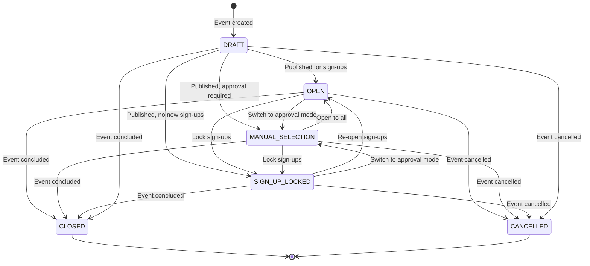
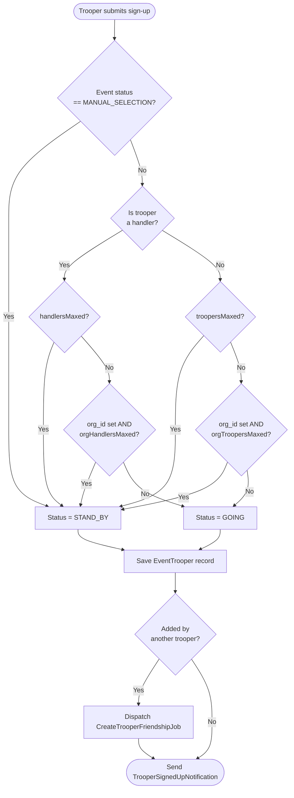
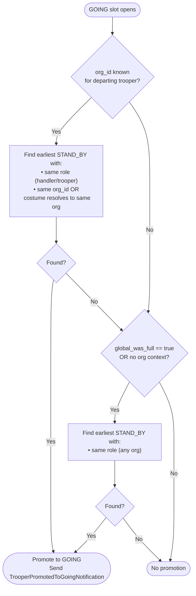

# Events

## Event Types

Events are categorized by type for reporting and filtering. **Type does not affect business logic** — all 12 types share identical signup, capacity, and status-transition behavior.

| Enum | DB Value | Description |
|---|---|---|
| `REGULAR` | `regular` | Standard costuming appearance |
| `ARMOR_PARTY` | `armorparty` | Social armor build/maintenance gathering |
| `CHARITY` | `charity` | Charitable fundraising event |
| `PUBLIC_RELATIONS` | `publicrelations` | PR or promotional appearance |
| `DISNEY` | `disney` | Disney-related appearance |
| `LUCAS_FILM_LIMITED` | `lucasfilm` | Official Lucasfilm/Star Wars event |
| `CONVENTION` | `convention` | Convention or expo |
| `HOSPITAL` | `hospital` | Hospital visit or patient interaction |
| `WEDDING` | `wedding` | Private wedding appearance |
| `BIRTHDAY_PARTY` | `birthdayparty` | Private birthday party |
| `VIRTUAL_TROOP` | `virtualtroop` | Online/remote virtual event |
| `OTHER` | `other` | Anything else |

**Source:** `app/Enums/EventType.php`

---

## Event Status Lifecycle

An event moves through statuses as it progresses from creation to completion.



### Status Descriptions

| Status | DB Value | `is_open` | `is_active` | Description |
|---|---|---|---|---|
| `DRAFT` | `draft` | No | Yes | Created but not yet visible for sign-ups |
| `OPEN` | `open` | Yes | Yes | Accepting sign-ups normally |
| `MANUAL_SELECTION` | `manualselection` | Yes | Yes | Sign-ups land as STAND_BY; admin approves each one |
| `SIGN_UP_LOCKED` | `locked` | No | Yes | No new sign-ups; existing roster unchanged |
| `CLOSED` | `closed` | No | No | Event has concluded |
| `CANCELLED` | `cancelled` | No | No | Event was cancelled |

### Side Effects on Transition

| Transition | Side Effects |
|---|---|
| DRAFT → OPEN / MANUAL_SELECTION / SIGN_UP_LOCKED | All shifts updated to match new status; `SendEventCreatedNotificationsJob` dispatched |
| Any → CANCELLED | All shifts set to CANCELLED; all active `EventTrooper` records set to CANCELLED; `SendEventCancelledNotificationsJob` dispatched |
| Capacity limits changed | `ReconcileEventRosterJob` dispatched to re-evaluate the roster |

**Source:** `app/Http/Controllers/Admin/Events/UpdateSubmitController.php:51-95`

---

## Signup Flow

When a trooper signs up for a shift, the system determines whether they are assigned **GOING** (confirmed) or **STAND_BY** (waiting).



**Source:** `app/Features/Events/Commands/SignUpEventTrooperCommandHandler.php`

---

## Standby Promotion Flow

When a confirmed (GOING) slot opens — due to cancellation, a role switch, or a reconcile run — the system promotes the next eligible STAND_BY trooper.



**Org priority:** When a trooper held an org-limited slot, the system first offers that slot to the next STAND_BY from the same org (by `organization_id` or by costume org inference). Only if no same-org STAND_BY exists — or if global capacity was also full — does it consider troopers from any org.

**Source:** `app/Features/Events/Commands/PromoteNextInLineEventTrooperCommandHandler.php`

---

## Trooper Attendance Status

Once signed up, a trooper's attendance is tracked by `EventTrooperStatus`.

| Status | DB Value | Set By | Meaning |
|---|---|---|---|
| `NONE` | `none` | System | Default; no status assigned |
| `GOING` | `going` | System / Trooper | Confirmed attendance |
| `STAND_BY` | `standby` | System | Waitlisted; promoted when a slot opens |
| `TENTATIVE` | `tentative` | Trooper | Trooper is unsure; only available on non-limited events |
| `PENDING` | `pending` | System | Pending admin approval (MANUAL_SELECTION events) |
| `ATTENDED` | `attended` | Admin | Trooper showed up and attended |
| `CANCELLED` | `cancelled` | Trooper / System | Trooper withdrew or event was cancelled |
| `NOT_PICKED` | `notpicked` | Admin | Not selected for a limited/manual-selection event |
| `NO_SHOW` | `noshow` | Admin | Confirmed GOING but did not appear |
| `UNABLE_TO_ATTEND` | `unabletoattend` | Admin | Could not attend for external reasons |

**Source:** `app/Enums/EventTrooperStatus.php`

---

## Capacity Enforcement

Capacity is enforced at two levels. Both are checked on every sign-up.

### Global Limits (per event)

Stored on the `events` table:

| Column | Controls |
|---|---|
| `troopers_allowed` | Max total troopers per shift |
| `handlers_allowed` | Max total handlers per shift |
| `shifts_allowed` | Max shifts a single trooper can join on this event |
| `friends_allowed` | Max friends a trooper can add to a shift |
| `guests_allowed` | Max guests a trooper can add to a shift |

`NULL` means unlimited.

### Per-Organization Limits

Stored on the `event_organizations` table (one row per org invited to the event):

| Column | Controls |
|---|---|
| `troopers_allowed` | Max troopers from this org per shift |
| `handlers_allowed` | Max handlers from this org per shift |

`NULL` means no per-org cap for that role.

### Reconciliation

When an admin changes capacity limits on an active event, `ReconcileEventRosterJob` is dispatched. It re-evaluates every GOING and STAND_BY trooper on each shift, sorted by `signed_up_at` (earliest first), and promotes or demotes as needed to match the new limits. Affected troopers receive an email notification.

**Source:** `app/Jobs/ReconcileEventRosterJob.php`, `app/Models/EventShift.php`

---

## Notification Summary

| Trigger | Notification |
|---|---|
| Trooper signs up | `TrooperSignedUpNotification` |
| STAND_BY promoted to GOING (cancellation/role change) | `TrooperPromotedToGoingNotification` |
| Admin approves a STAND_BY (MANUAL_SELECTION event) | `ManualSelectionApprovedNotification` |
| Admin demotes a trooper (MANUAL_SELECTION event) | `ManualSelectionStandByNotification` |
| Event transitions from DRAFT to any open state | `SendEventCreatedNotificationsJob` |
| Event cancelled | `SendEventCancelledNotificationsJob` |
| Reconcile promotes a trooper | `TrooperNextInLine` email |
| Reconcile demotes a trooper | `TrooperManualSelectionStandBy` email |
| Daily digest | `DailyEventNotification` |

---

## Shift Structure

Each event contains one or more **shifts** (`EventShift`). Troopers sign up for individual shifts, not the event itself. Capacity limits are enforced per shift.

```
Event
└── EventShift (e.g., "Morning", "Afternoon")
    └── EventTrooper (one per trooper per shift)
```

When an event's status changes, all of its shifts are updated to match. Shift-level capacity checks happen inside `EventShift::troopersMaxed()`, `handlersMaxed()`, and `orgTroopersMaxed()`.

**Source:** `app/Models/EventShift.php:145-215`
