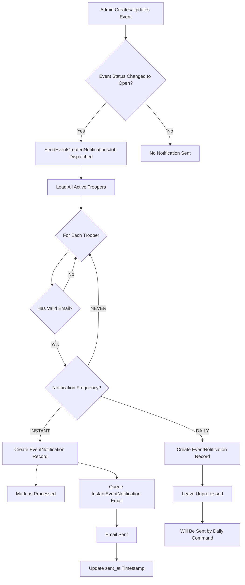
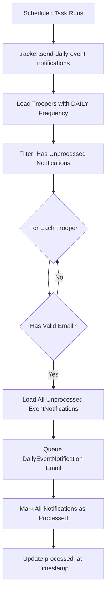
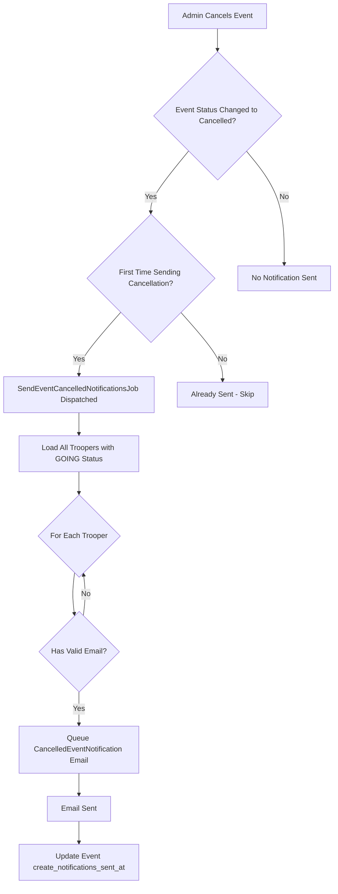
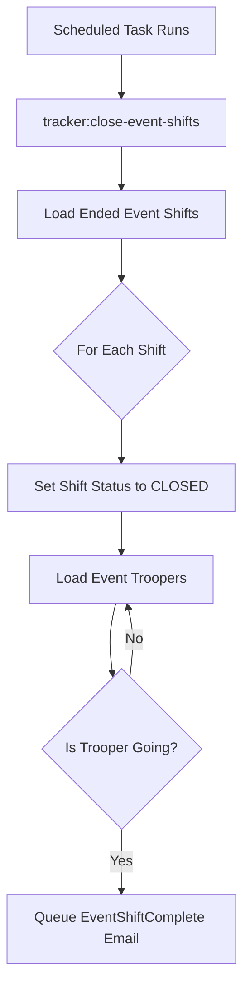
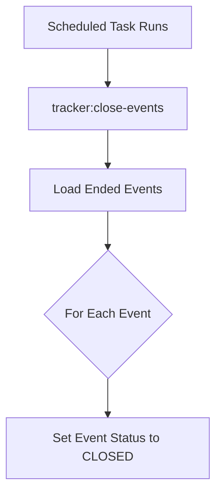

# Event Notifications

Event notification system for informing troopers about new events and cancellations.

## Notification Types

- **Instant**: Email sent immediately on event creation
- **Daily**: Digest email with all events since last notification
- **Never**: No notifications sent

## Event Created Notifications

### Workflow



### SendEventCreatedNotificationsJob

**Triggered When:** An event's status changes to "open" (published)

**Purpose:** Orchestrates the creation of notification records for all active troopers.

**Implementation:** This job dispatches the `SendEventCreatedNotificationCommand` for each eligible trooper through the MagicBus. The command handler:

1. Validates trooper's email address
2. Creates an `EventNotification` record
3. **If notification_frequency is INSTANT:**
   - Marks notification as processed immediately
   - Queues instant email via `InstantEventNotification` mailable
4. **If notification_frequency is DAILY:**
   - Leaves notification unprocessed
   - Will be picked up by the daily notification command

**Key Components:**
- `SendEventCreatedNotificationsJob` - Queue job that orchestrates the process
- `SendEventCreatedNotificationCommand` - Command dispatched for each trooper
- `SendEventCreatedNotificationCommandHandler` - Handles notification creation logic
- `Event` - The event being notified about
- `EventNotification` - Tracks which troopers have been notified
- `Trooper` - Active troopers with valid email addresses

## Daily Event Notification Command

### Workflow



### SendDailyEventNotifications Command

**Triggered When:** Scheduled task runs (typically once per day)

**Command:** `php artisan tracker:send-daily-event-notifications`

**Purpose:** Sends digest emails containing all unprocessed event notifications to troopers who prefer daily notifications.

**Implementation:** This Artisan command orchestrates the daily notification process by:

1. Dispatching `GetTroopersForDailyEventNotificationsQuery` to retrieve eligible troopers
2. Dispatching `SendEventDailyNotificationCommand` for each trooper
3. The command handler queues the digest email and marks notifications as processed

**Process:**
1. Queries all active troopers with `notification_frequency = DAILY` and unprocessed notifications
2. For each eligible trooper:
   - Validates their email address via command handler
   - Queues a single digest email via `DailyEventNotification` mailable
   - Marks all event_notifications as processed (sets `processed_at` timestamp)

**Key Components:**
- `SendDailyEventNotifications` - Artisan command (orchestrator)
- `GetTroopersForDailyEventNotificationsQuery` - Retrieves eligible troopers
- `SendEventDailyNotificationCommand` - Command for each trooper
- `SendEventDailyNotificationCommandHandler` - Handles email queueing and marking processed

**Scheduling:**
This command should be scheduled to run daily.

## Event Cancelled Notifications

### Workflow



### SendEventCancelledNotificationsJob

**Triggered When:** An event's status changes to "cancelled"

**Purpose:** Notifies all troopers who signed up for the cancelled event.

**Implementation:** This job dispatches the `SendEventCancelledNotificationCommand` through the MagicBus. The command handler:

1. Checks if cancellation notifications have already been sent (via `create_notifications_sent_at`)
2. Queries all active troopers with `GOING` status for any shift in the event
3. For each trooper:
   - Validates their email address
   - Queues cancellation email via `CancelledEventNotification` mailable
4. Updates event's `create_notifications_sent_at` timestamp to prevent duplicate sends

**Key Components:**
- `SendEventCancelledNotificationsJob` - Queue job (orchestrator)
- `SendEventCancelledNotificationCommand` - Command for the cancelled event
- `SendEventCancelledNotificationCommandHandler` - Handles notification logic

**Important Notes:**
- Cancellation notifications are sent **regardless of notification frequency**
- This ensures troopers who committed to an event are always notified of cancellations
- The notification is sent only once per event

## Event Shift Completion Notifications

### Workflow



### CloseEventShiftsCommand

**Command:** `php artisan tracker:close-event-shifts`

**Purpose:** Closes ended event shifts and notifies troopers who attended.

**Implementation:** This Artisan command orchestrates the shift closing process by:

1. Dispatching `GetEventShiftsToCloseQuery` to retrieve ended shifts
2. Updating each shift's status to `CLOSED`
3. Queueing `EventShiftComplete` emails for troopers with `GOING` status

**Key Components:**
- `CloseEventShiftsCommand` - Artisan command (orchestrator)
- `GetEventShiftsToCloseQuery` - Retrieves shifts that have ended
- `EventShiftComplete` - Mailable sent to attending troopers

## Event Closing Command

### Workflow



### CloseEventsCommand

**Command:** `php artisan tracker:close-events`

**Purpose:** Closes events whose end date has passed.

**Implementation:** This Artisan command orchestrates the event closing process by:

1. Dispatching `GetEventsToCloseQuery` to retrieve ended events
2. Updating each event's status to `CLOSED`

**Key Components:**
- `CloseEventsCommand` - Artisan command (orchestrator)
- `GetEventsToCloseQuery` - Retrieves events that have ended

## Email Templates

### InstantEventNotification
- **Subject:** "Troop Tracker - New Event Posted"
- **Template:** `emails.events.instant-event-notification`
- **Data:** Single event with all shifts
- **Tracks:** `sent_at` timestamp on `EventNotification` record

### DailyEventNotification
- **Subject:** "Troop Tracker - New Event Posted" 
- **Template:** `emails.events.daily-event-notification`
- **Data:** Collection of multiple events posted since last digest
- **Tracks:** `sent_at` timestamp on each `EventNotification` record

### CancelledEventNotification
- **Subject:** "Troop Tracker - Event Cancelled"
- **Template:** `emails.events.cancelled-event-notification`
- **Data:** Cancelled event details
- **Tracks:** Via event's `create_notifications_sent_at` timestamp

## Database References

See [docs/DATABASE.md](docs/DATABASE.md) for table details and column references.

## Implementation Details

### Architecture

The notification system follows the **Command/Query** pattern:

- **Jobs** (SendEventCreatedNotificationsJob, SendEventCancelledNotificationsJob) orchestrate workflow
- **Commands** (SendEventCreatedNotificationCommand, SendEventDailyNotificationCommand, SendEventCancelledNotificationCommand) represent write operations
- **Command Handlers** contain the actual business logic for creating notifications and queueing emails
- **Queries** (GetTroopersForDailyEventNotificationsQuery) retrieve eligible troopers
- **MagicBus** dispatches commands and queries to their handlers

This separation ensures business logic is testable and reusable across different entry points.

### Email Validation

All notification command handlers validate trooper email addresses using:

```php
$trooper->emailAppearsValid()
```

This method checks that:
- The email field is not empty
- The email passes PHP's `filter_var($email, FILTER_VALIDATE_EMAIL)` validation

### Preventing Duplicate Notifications

**For Event Created:**
- Checks existing `EventNotification` records before creating new ones
- Prevents re-notifying troopers who already have a notification for the event

**For Event Cancelled:**
- Uses event's `create_notifications_sent_at` timestamp
- Job returns early if timestamp is already set

### Queue System

All notification emails implement `ShouldQueue` and are processed asynchronously:
- Prevents blocking HTTP requests
- Handles temporary email delivery failures
- Allows for retry logic on failures

## Best Practices

1. **Always validate email addresses** before sending notifications
2. **Use queued jobs** for all email sending to prevent timeouts
3. **Track notification state** to prevent duplicate sends
4. **Respect trooper preferences** - never override `NEVER` setting except for cancellations
5. **Log notification failures** for debugging and trooper support

## Troubleshooting

### Troopers Not Receiving Notifications

1. Check trooper's `notification_frequency` setting
2. Verify trooper's `membership_status` is `ACTIVE`
3. Validate email address format
4. Check queue worker is processing jobs
5. Review mail server logs for delivery issues

### Duplicate Notifications

1. Verify `EventNotification` records aren't being created multiple times
2. Check event's `create_notifications_sent_at` for cancellation notifications
3. Ensure jobs aren't being dispatched multiple times on event updates

### Daily Notifications Not Sending

1. Verify scheduled task is configured and running
2. Check for troopers with `notification_frequency = DAILY`
3. Confirm unprocessed `EventNotification` records exist
4. Review command output and logs
