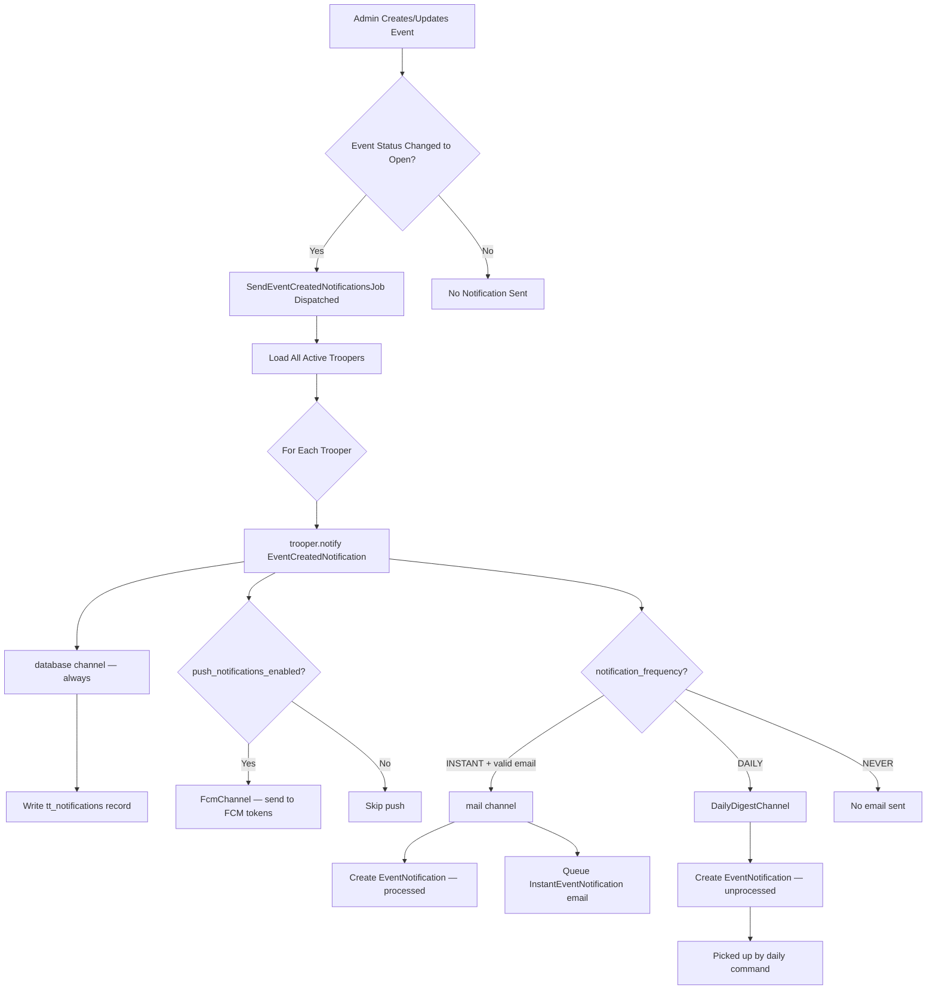
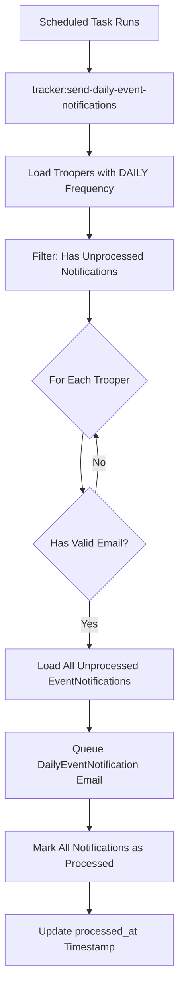
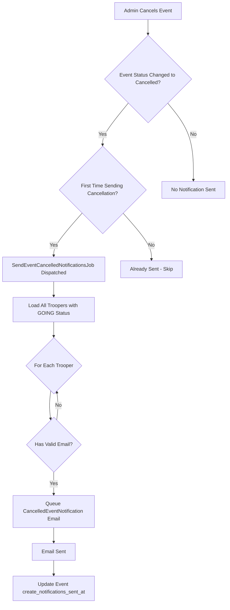
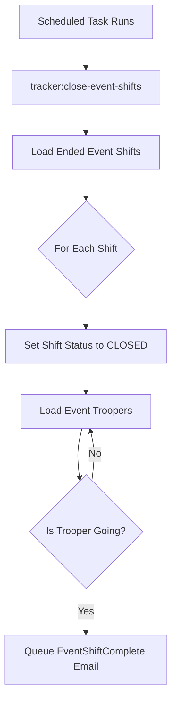
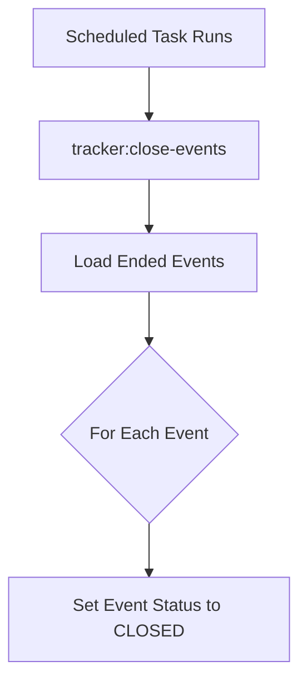

# Event Workflow

This document covers how events behave in the system, including notifications and mission brief acknowledgements.

## Mission Brief Acknowledgement

Some events require troopers to review and acknowledge the mission brief before they can participate.

### Overview

- Command staff can toggle a per-event flag `require_mission_brief_ack` when creating or editing an event.
- When enabled, troopers must decrypt/read the mission brief and explicitly acknowledge it on the event page.
- A single acknowledgement is stored per trooper per event in `tt_event_mission_acks` and is reused across all shifts and signup channels (web and mobile).

### Web App Behaviour

- Until a trooper has acknowledged the mission brief for an event:
   - Shift sign-up actions are blocked.
   - "Add a Trooper" and "Add a Guest" options are hidden/disabled.
- After acknowledgement:
   - Normal sign-up rules apply (event status, capacity, manual selection, guest limits, etc.).
   - The UI shows that the mission brief has been acknowledged.

### Data Model

- `tt_events.require_mission_brief_ack` (boolean, default `false`): enables the requirement for an event.
- `tt_event_mission_acks`:
   - Links a trooper to an event (`event_id`, `trooper_id`).
   - Records when the mission brief was acknowledged (`acknowledged_at`).
   - Enforced by application logic when evaluating whether a trooper can sign up or add guests.

## Event Notifications

Event notification system for informing troopers about new events and cancellations.

## Notification Types

`notification_frequency` controls **email delivery only**. Push and web inbox notifications are independent.

| Channel | Gate | Notes |
|---|---|---|
| Web inbox (`tt_notifications`) | Always | Cannot be disabled |
| Mobile push (FCM) | `push_notifications_enabled = true` | Trooper opt-out in account settings |
| Email — instant | `notification_frequency = INSTANT` | Sent immediately on event creation |
| Email — daily digest | `notification_frequency = DAILY` | Batched via daily artisan command |
| Email — disabled | `notification_frequency = NEVER` | No event creation emails sent |

## Event Created Notifications

### Workflow



### SendEventCreatedNotificationsJob

**Triggered When:** An event's status changes to "open" (published)

**Purpose:** Orchestrates notification delivery to all active troopers.

**Implementation:** This job dispatches `SendEventCreatedNotificationCommand` for each eligible trooper through the MagicBus. The command handler calls `$trooper->notify(new EventCreatedNotification($event))`. The notification's `via()` method selects channels based on trooper preferences:

- `database` — always included; writes a record to `tt_notifications` for the web/mobile inbox
- `FcmChannel` — included when `push_notifications_enabled = true`; sends FCM push to registered devices
- `mail` — included when `notification_frequency = INSTANT` and email is valid; queues `InstantEventNotification`; also creates a processed `EventNotification` record via `toMail()`
- `DailyDigestChannel` — included when `notification_frequency = DAILY`; creates an unprocessed `EventNotification` record for the daily digest command

**Key Components:**
- `SendEventCreatedNotificationsJob` - Queue job that orchestrates the process
- `SendEventCreatedNotificationCommand` / `SendEventCreatedNotificationCommandHandler` - Dispatches notification per trooper
- `EventCreatedNotification` - Laravel Notification class; owns channel selection logic
- `FcmChannel` - Custom channel; sends FCM via `kreait/laravel-firebase`
- `DailyDigestChannel` - Custom channel; creates `EventNotification` record for digest
- `EventNotification` - Tracks email delivery state (processed_at, sent_at)

## Daily Event Notification Command

### Workflow



### SendDailyEventNotifications Command

**Triggered When:** Scheduled task runs (typically once per day)

**Command:** `php artisan tracker:send-daily-event-notifications`

**Purpose:** Sends digest emails containing all unprocessed event notifications to troopers who prefer daily notifications.

**Implementation:** This Artisan command orchestrates the daily notification process by:

1. Dispatching `GetTroopersForDailyEventNotificationsQuery` to retrieve eligible troopers
2. Dispatching `SendEventDailyNotificationCommand` for each trooper
3. The command handler queues the digest email and marks notifications as processed

**Process:**
1. Queries all active troopers with `notification_frequency = DAILY` and unprocessed notifications
2. For each eligible trooper:
   - Validates their email address via command handler
   - Queues a single digest email via `DailyEventNotification` mailable
   - Marks all event_notifications as processed (sets `processed_at` timestamp)

**Key Components:**
- `SendDailyEventNotifications` - Artisan command (orchestrator)
- `GetTroopersForDailyEventNotificationsQuery` - Retrieves eligible troopers
- `SendEventDailyNotificationCommand` - Command for each trooper
- `SendEventDailyNotificationCommandHandler` - Handles email queueing and marking processed

**Scheduling:**
This command should be scheduled to run daily.

## Event Cancelled Notifications

### Workflow



### SendEventCancelledNotificationsJob

**Triggered When:** An event's status changes to "cancelled"

**Purpose:** Notifies all troopers who signed up for the cancelled event.

**Implementation:** This job dispatches `SendEventCancelledNotificationCommand` through the MagicBus. The command handler calls `$trooper->notify(new EventCancelledNotification($event))`. The notification's `via()` method always includes:

- `database` — writes to `tt_notifications` inbox
- `FcmChannel` — when `push_notifications_enabled = true`
- `mail` — when email is valid, regardless of `notification_frequency`

Updates event's `cancel_notifications_sent_at` timestamp to prevent duplicate sends.

**Key Components:**
- `SendEventCancelledNotificationsJob` - Queue job (orchestrator)
- `SendEventCancelledNotificationCommand` / `SendEventCancelledNotificationCommandHandler` - Dispatches notification per trooper
- `EventCancelledNotification` - Laravel Notification class

**Important Notes:**
- Email is always sent regardless of `notification_frequency` — troopers who committed are always notified
- Push is sent regardless of `notification_frequency` but still respects `push_notifications_enabled`
- The notification is sent only once per event

## Event Shift Completion Notifications

### Workflow



### CloseEventShiftsCommand

**Command:** `php artisan tracker:close-event-shifts`

**Purpose:** Closes ended event shifts and notifies troopers who attended.

**Implementation:** This Artisan command orchestrates the shift closing process by:

1. Dispatching `GetEventShiftsToCloseQuery` to retrieve ended shifts
2. Updating each shift's status to `CLOSED`
3. Queueing `EventShiftComplete` emails for troopers with `GOING` status

**Key Components:**
- `CloseEventShiftsCommand` - Artisan command (orchestrator)
- `GetEventShiftsToCloseQuery` - Retrieves shifts that have ended
- `EventShiftComplete` - Mailable sent to attending troopers

## Event Closing Command

### Workflow



### CloseEventsCommand

**Command:** `php artisan tracker:close-events`

**Purpose:** Closes events whose end date has passed.

**Implementation:** This Artisan command orchestrates the event closing process by:

1. Dispatching `GetEventsToCloseQuery` to retrieve ended events
2. Updating each event's status to `CLOSED`

**Key Components:**
- `CloseEventsCommand` - Artisan command (orchestrator)
- `GetEventsToCloseQuery` - Retrieves events that have ended

## Email Templates

### InstantEventNotification
- **Subject:** "Troop Tracker - New Event Posted"
- **Template:** `emails.events.instant-event-notification`
- **Data:** Single event with all shifts
- **Tracks:** `sent_at` timestamp on `EventNotification` record

### DailyEventNotification
- **Subject:** "Troop Tracker - New Event Posted" 
- **Template:** `emails.events.daily-event-notification`
- **Data:** Collection of multiple events posted since last digest
- **Tracks:** `sent_at` timestamp on each `EventNotification` record

### CancelledEventNotification
- **Subject:** "Troop Tracker - Event Cancelled"
- **Template:** `emails.events.cancelled-event-notification`
- **Data:** Cancelled event details
- **Tracks:** Via event's `create_notifications_sent_at` timestamp

## Database References

See [docs/DATABASE.md](docs/DATABASE.md) for table details and column references.

## Implementation Details

### Architecture

The notification system follows the **Command/Query** pattern with **Laravel Notifications** as the dispatch mechanism:

- **Jobs** (SendEventCreatedNotificationsJob, SendEventCancelledNotificationsJob) orchestrate workflow
- **Commands** (SendEventCreatedNotificationCommand, SendEventDailyNotificationCommand, SendEventCancelledNotificationCommand) represent write operations
- **Command Handlers** call `$trooper->notify(new SomeNotification(...))` — no direct mail or push logic
- **Laravel Notification classes** own channel selection in their `via()` method
- **Custom channels** (`FcmChannel`, `DailyDigestChannel`) handle FCM and digest record creation
- **Queries** (GetTroopersForDailyEventNotificationsQuery) retrieve eligible troopers
- **MagicBus** dispatches commands and queries to their handlers

This separation ensures business logic is testable and reusable across different entry points.

### Channel Selection Rules

Each `Notification::via()` selects channels at dispatch time based on trooper preferences:

| Channel | When included |
|---|---|
| `'database'` | Always — no user control |
| `FcmChannel::class` | `push_notifications_enabled = true` |
| `'mail'` (instant) | `notification_frequency = INSTANT` and email valid |
| `DailyDigestChannel::class` | `notification_frequency = DAILY` |
| `'mail'` (transactional) | Email valid — ignores `notification_frequency` |

Transactional notifications (sign-up confirmed, promoted from waitlist, membership approved, manual selection changes, cancellations) always send email when email is valid, regardless of `notification_frequency`.

### Email Validation

All notifications check trooper email addresses before including the `mail` channel:

```php
$notifiable->emailAppearsValid()
```

This checks that the email field is non-empty and passes `filter_var($email, FILTER_VALIDATE_EMAIL)`.

### Preventing Duplicate Notifications

**For Event Created:**
- `EventCreatedNotification::toMail()` uses `firstOrCreate` on `EventNotification` records
- Prevents duplicate `EventNotification` records if notification fires more than once

**For Event Cancelled:**
- Uses event's `cancel_notifications_sent_at` timestamp
- Job returns early if timestamp is already set

### Queue System

All notification emails implement `ShouldQueue` and are processed asynchronously:
- Prevents blocking HTTP requests
- Handles temporary email delivery failures
- Allows for retry logic on failures

## Best Practices

1. **Always validate email addresses** before including the `mail` channel in `via()`
2. **Use queued jobs** for all email sending to prevent timeouts
3. **Track notification state** to prevent duplicate sends
4. **Channel selection belongs in `via()`** — command handlers and controllers call `$trooper->notify()` and nothing else
5. **`notification_frequency = NEVER` only suppresses email** — push and web inbox still fire
6. **Transactional notifications always send email** (sign-up, promotion, approval, cancellation) regardless of frequency

## Troubleshooting

### Troopers Not Receiving Email Notifications

1. Check trooper's `notification_frequency` setting
2. Verify trooper's `membership_status` is `ACTIVE`
3. Validate email address format
4. Check queue worker is processing jobs
5. Review mail server logs for delivery issues

### Troopers Not Receiving Push Notifications

1. Check `push_notifications_enabled` on the trooper's account settings
2. Verify a device is registered in `tt_mobile_devices` for the trooper
3. Check `FcmChannel` — if messaging is null (Firebase not configured), push is silently skipped
4. Invalid tokens are auto-deleted on FCM failure — trooper may need to re-register the device

### Duplicate Notifications

1. Verify `EventNotification` records aren't being created multiple times
2. Check event's `create_notifications_sent_at` for cancellation notifications
3. Ensure jobs aren't being dispatched multiple times on event updates

### Daily Email Digest Not Sending

1. Verify scheduled task is configured and running
2. Check for troopers with `notification_frequency = DAILY`
3. Confirm unprocessed `EventNotification` records exist (`processed_at IS NULL`)
4. Review command output and logs

### Web Inbox Not Showing Notifications

1. Confirm `tt_notifications` table exists and migrations have run
2. Check that `Trooper` model uses the `Notifiable` trait
3. Verify `TrooperNotification` model points to `tt_notifications` table
