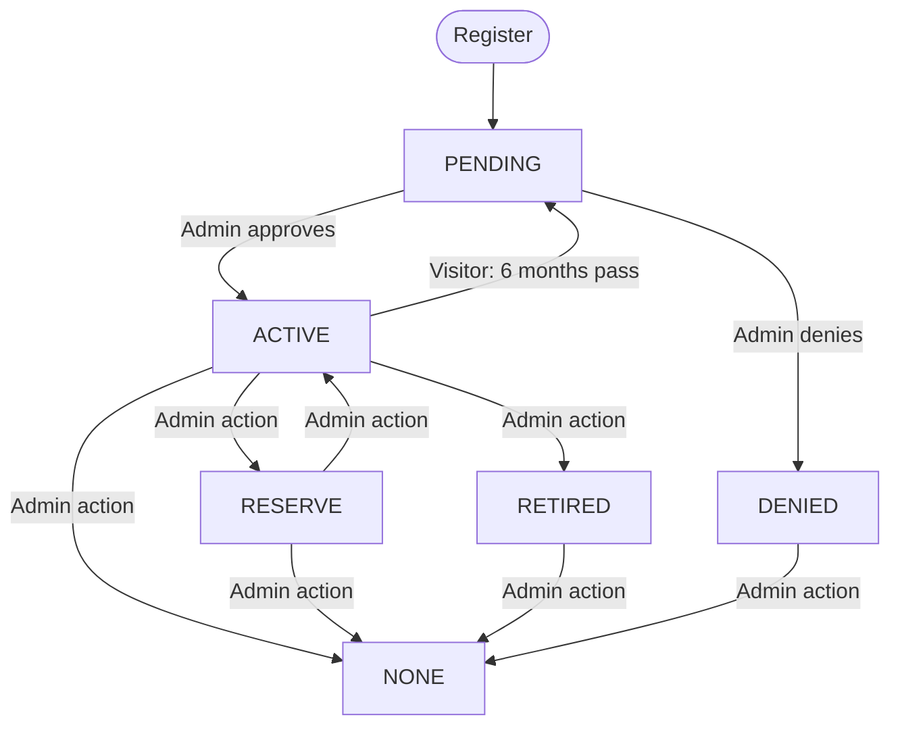
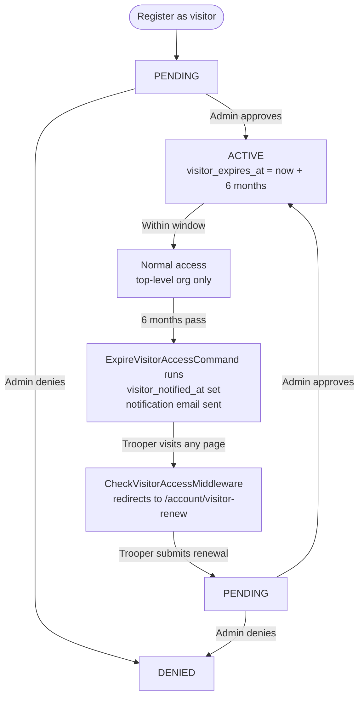

# Membership Roles and Status

Every trooper account carries two orthogonal fields that together determine what a trooper can do:

- **`membership_status`** — where the trooper is in the approval/activity lifecycle
- **`membership_role`** — which permission tier the trooper holds

These are global, per-account values. Organization-level moderation scope is a separate concept
(see [Moderator Scope](#moderator-scope) below).

---

## Membership Status

| Status | Value | Meaning |
|---|---|---|
| PENDING | `pending` | Application submitted, awaiting admin approval |
| ACTIVE | `active` | Approved and in good standing; full role access |
| DENIED | `denied` | Application or renewal was rejected; no access |
| RESERVE | `reserve` | Temporarily inactive; event access suspended |
| RETIRED | `retired` | Permanently stepped back; no event access |
| NONE | `none` | No membership record; treated as a stranger |

Feature access generally requires `membership_status === ACTIVE`. Status changes are applied by admins via the authority panel, except for the visitor renewal flow which automatically resets status to PENDING.

### Status Lifecycle

---

## Membership Roles

### MEMBER

The default role. Assigned automatically on registration unless `account_type` is specified.

**Can:**
- Sign up for events with costume selection
- Manage personal costumes
- View service records and event history
- Join organizations (subject to org rules)

**Cannot:**
- Create or manage events
- Approve or deny other troopers
- Access the admin dashboard

**Assigned by:** Registration default  
**Changed by:** Admin via authority panel

---

### HANDLER

For troopers who accompany costumed members but do not wear a costume themselves.

**Can:**
- Sign up for events marked as a handler (`is_handler = true`)
- Access account dashboard

**Cannot:**
- Select a costume for events (Costumes tab hidden)
- Join sub-organizations the same way regular members do
- Create or manage events
- Access admin functions

**Assigned by:** Registration with `account_type=handler`, or admin via authority panel  
**Changed by:** Admin via authority panel (clears visitor timestamps if previously VISITOR)

---

### VISITOR

A time-limited role for prospective members or guests. Access renews in 6-month windows.

**Can:**
- Sign up for events under the top-level organization only
- Access account dashboard and renewal flow

**Cannot:**
- Join sub-organizations (restricted to `depth = 0`)
- Moderate or administrate anything
- Access beyond expiry without renewal

**Assigned by:** Registration with `account_type=visitor`, or admin via authority panel  
**Expiry:** `visitor_expires_at` is set to `now() + 6 months` on approval. After expiry, `CheckVisitorAccessMiddleware` redirects all requests to `/account/visitor-renew`. See [Visitor Lifecycle](#visitor-lifecycle) below.

---

### MODERATOR

An elevated role scoped to specific organizations. Cannot be self-assigned.

**Can:**
- Create and manage events within assigned organizations
- Approve and deny trooper applications within scope
- Manage notices, awards, and costumes within scope
- View all troopers scoped to their organizations

**Cannot:**
- Access system-wide admin functions
- Act outside their assigned organization scope

**Assigned by:** Admin only, via authority panel  
**Scope:** Determined by `TrooperAssignment.is_moderator` flags per organization (see [Moderator Scope](#moderator-scope))  
**Changed by:** Admin via authority panel — all `is_moderator` flags are cleared when role is changed away from MODERATOR

---

### ADMINISTRATOR

Full unrestricted system access. Cannot be self-assigned.

**Can:**
- Everything a MODERATOR can, without any org scoping
- Change membership roles and statuses of any trooper
- Manage all organizations, costumes, events, awards, and notices globally
- Access all admin-only routes (`CheckActorRoleMiddleware` passes unconditionally)

**Assigned by:** Admin only  
**Changed by:** Admin only

---

## Permissions Comparison

| Capability | MEMBER | HANDLER | VISITOR | MODERATOR | ADMINISTRATOR |
|---|:---:|:---:|:---:|:---:|:---:|
| Sign up for events | ✓ | ✓ (handler) | ✓ (top-level only) | ✓ | ✓ |
| Manage own costumes | ✓ | — | ✓ | ✓ | ✓ |
| Create/manage events | — | — | — | ✓ (scoped) | ✓ |
| Approve/deny troopers | — | — | — | ✓ (scoped) | ✓ |
| Manage notices/awards | — | — | — | ✓ (scoped) | ✓ |
| Change trooper roles | — | — | — | — | ✓ |
| Unrestricted org scope | — | — | — | — | ✓ |

---

## Visitor Lifecycle

**Key fields on `tt_troopers`:**

| Field | Purpose |
|---|---|
| `membership_role` | Set to `visitor`; the source of truth for visitor status |
| `visitor_expires_at` | Datetime when access window closes |
| `visitor_notified_at` | Set when the expiry notification email is sent; prevents duplicate sends |

**`is_visitor`** is a computed accessor on the `Trooper` model (`getIsVisitorAttribute`) — it is not a database column. It returns `true` when `membership_role === MembershipRole::VISITOR`.

---

## Moderator Scope

The `MODERATOR` role alone does not define what a moderator can act on. Scope is set separately via `TrooperAssignment.is_moderator`:

- Each trooper–organization pair in `tt_trooper_assignments` has an `is_moderator` boolean.
- When an admin assigns the MODERATOR role, they also select organizations via the authority panel.
- Selecting a parent organization cascades `is_moderator = true` down to all child organizations automatically.
- When the role is changed away from MODERATOR, all `is_moderator` flags for that trooper are reset to `false`.

Queries use `Trooper::moderatedBy($trooper)` to filter results. Administrators bypass this scope entirely.

---

## Key Code References

| Concern | Path |
|---|---|
| Role enum | `app/Enums/MembershipRole.php` |
| Status enum | `app/Enums/MembershipStatus.php` |
| Visitor expiry middleware | `app/Http/Middleware/CheckVisitorAccessMiddleware.php` |
| Role gate middleware | `app/Http/Middleware/CheckActorRoleMiddleware.php` |
| Permission trait | `app/Policies/Concerns/HasTrooperPermissionsTrait.php` |
| Register handler | `app/Features/Troopers/Commands/RegisterTrooperCommandHandler.php` |
| Approve handler | `app/Features/Troopers/Commands/ApproveTrooperCommandHandler.php` |
| Role change handler | `app/Features/Troopers/Commands/UpdateTrooperAuthorityCommandHandler.php` |
| Visitor expiry command | `app/Console/Commands/ExpireVisitorAccessCommand.php` |
| Visitor renewal controller | `app/Http/Controllers/Account/VisitorRenewSubmitController.php` |
