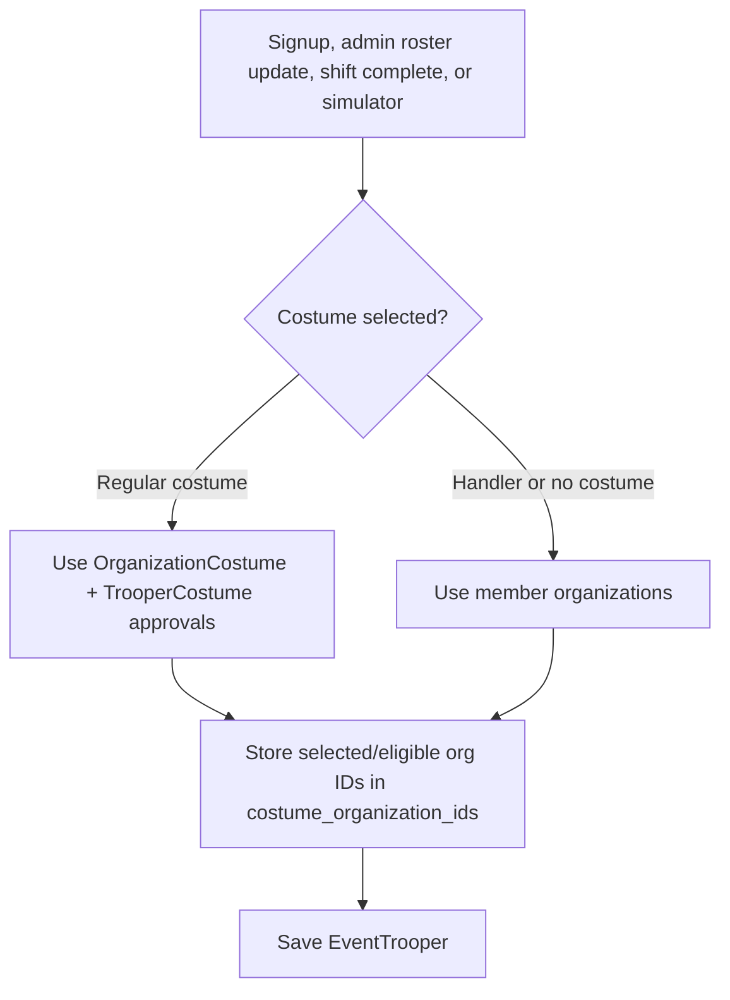
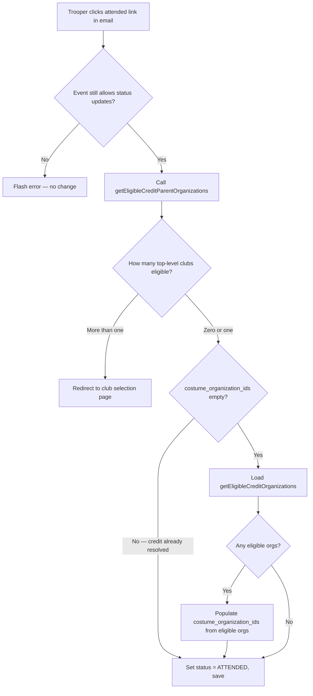
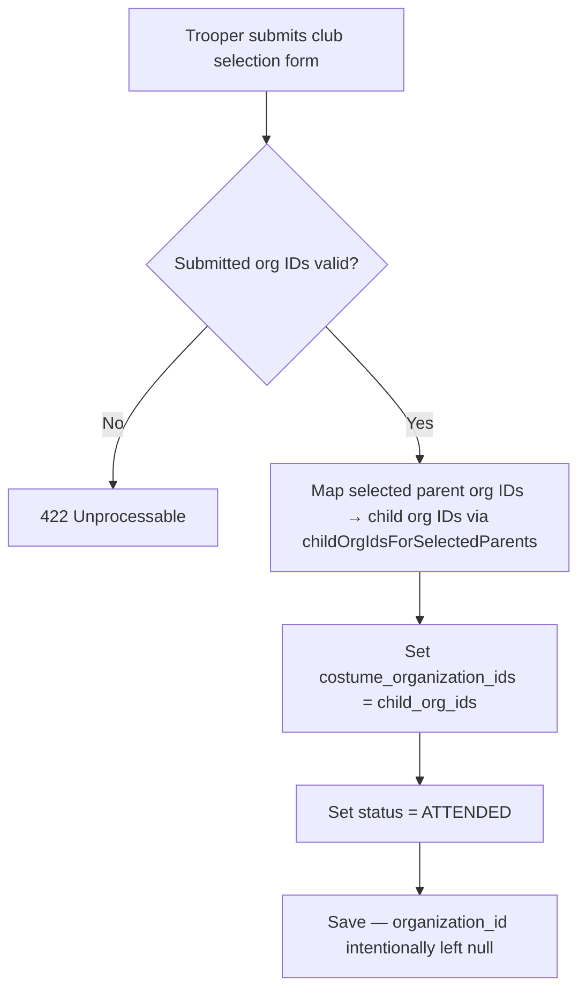
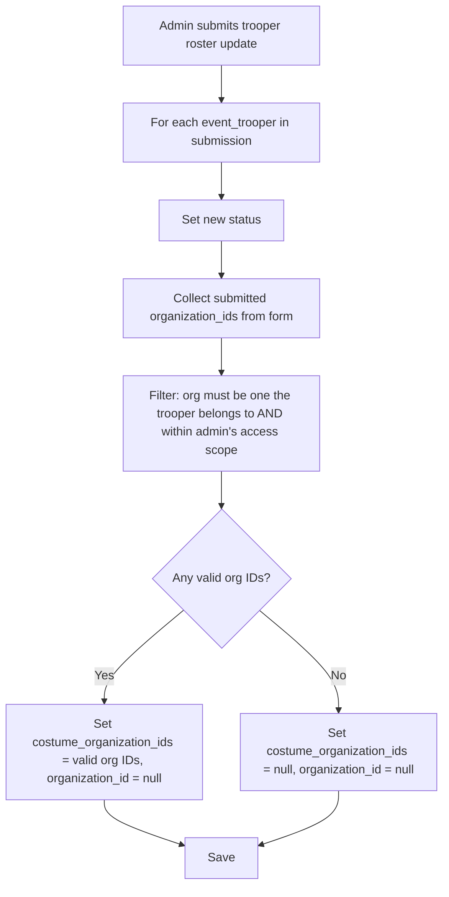
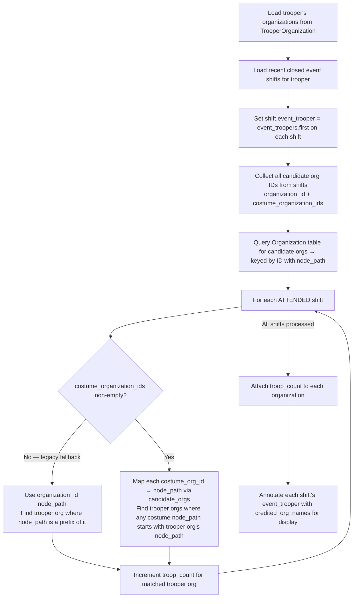
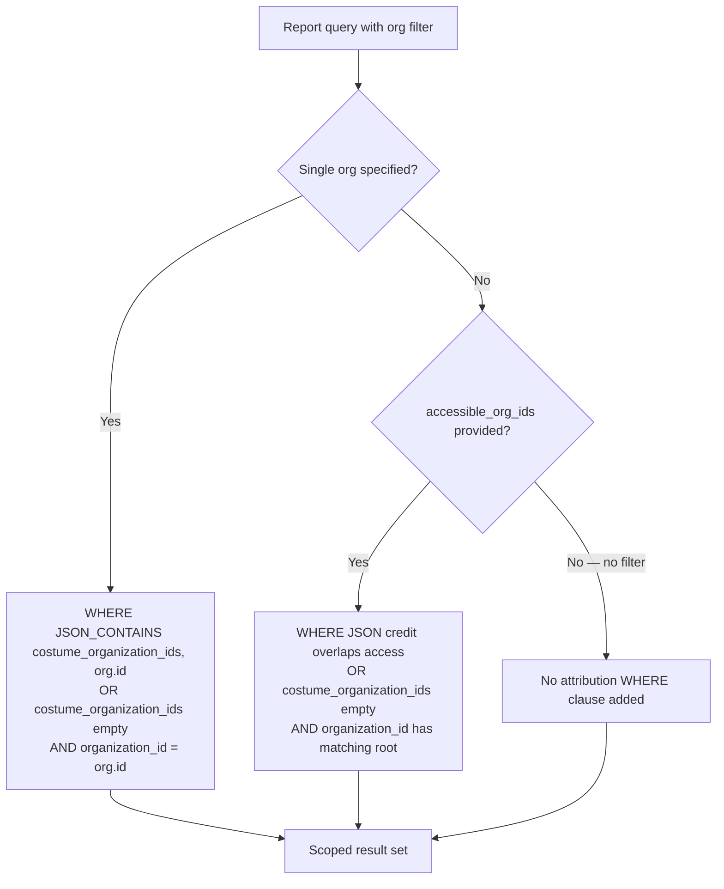

# Troop Credit

This document explains how troop credit is attributed to organizations when a trooper attends an event shift — from how credit data is stored on the `EventTrooper` record, through attendance confirmation, to how it's surfaced on service records and reports.

---

## Overview

When a trooper attends a shift, their attendance can credit one or more organizations. Two fields on `tt_event_troopers` serve distinct purposes:

| Field | Purpose |
|---|---|
| `organization_id` | Capacity tracking only — which per-org slot was occupied at signup |
| `costume_organization_ids` | Credit attribution — JSON array of org IDs the trooper selected or that were auto-resolved from costume approvals |

**Credit always flows through `costume_organization_ids`** for records created after the self-service flow was updated. For older records that have `organization_id` set but `costume_organization_ids` empty, the service record query falls back to `organization_id` for backward compatibility.

- **Current path** — credit goes to orgs in `costume_organization_ids`
- **Legacy fallback** — if `costume_organization_ids` is empty and `organization_id` is set, credit goes to that org
- **No match** — both fields are empty/null: no org receives credit

---

## Organization Hierarchy

Organizations are hierarchical — a club contains regions, regions contain units. The `node_path` column encodes this as a colon-delimited chain of IDs:

```
501           ← top-level club (garrison)
501:42        ← region inside that club
501:42:7      ← unit inside that region
```

Credit attributed to a child org rolls up to its parent. When the service record queries whether a shift credits org `501`, it checks whether the credited org's `node_path` starts with `"501"` — so a shift credited to region `501:42` also counts for the club `501`.

---

## How `costume_organization_ids` Gets Populated

`costume_organization_ids` is populated explicitly by the flow that creates or updates the credit decision. It is not recomputed by the `EventTrooperObserver`.



**Result**: `costume_organization_ids` reflects the orgs selected for credit, or the eligible orgs for flows that can safely auto-resolve credit.

`organization_id` may still be present for capacity tracking or old records. It is not allowed to override a non-empty `costume_organization_ids` value.

---

## Attendance Credit Assignment

Credit is finalized when a trooper's status is set to `ATTENDED`. This can happen via the trooper's self-service link, admin roster update, or shift simulation.

### Trooper self-service flow



### Multi-club selection (when trooper must choose)

Shown when `getEligibleCreditParentOrganizations` returns more than one top-level club — the trooper selects which club(s) should receive credit.



`organization_id` is intentionally **not** set here — multi-club credit flows via `costume_organization_ids` so more than one club can be credited.

### Admin roster update flow



The admin path always clears `organization_id` and sets `costume_organization_ids`, routing credit through the primary credit field.

---

## Service Record: Per-Org Troop Count

The service record page shows each organization the trooper belongs to, with a `troop_count` of how many closed shifts credited that org. This is computed in PHP using the `HasOrgCreditAnnotation` trait.



**Key invariant**: `str_starts_with(credited_org.node_path, trooper_org.node_path)` — a shift credited to any child of the trooper's org still increments that org's count. A shift credited to an unrelated org does not.

---

## Reports: SQL Attribution

The `HasOrgAttributionQuery` trait applies org filtering at the SQL level for reports like the Trooper Event Summary. It accepts either a single `Organization` model or a list of `accessible_org_ids` (root-level IDs that a moderator can see).



The multi-org path uses `SUBSTRING_INDEX(node_path, ':', 1)` to extract the root club ID from a candidate org's path, then checks it against the `accessible_org_ids` list. This means a shift credited to region `501:42` is visible to a moderator whose access covers root org `501`.

---

## Where Credit Data Lives

| Table | Column | Role |
|---|---|---|
| `tt_event_troopers` | `organization_id` | Capacity tracking and legacy fallback when `costume_organization_ids` is empty |
| `tt_event_troopers` | `costume_organization_ids` | Primary credit attribution — orgs derived from costume approvals or admin/trooper selection |
| `tt_organization_costumes` | `organization_id`, `costume_id` | Links costumes to orgs |
| `tt_trooper_costumes` | `trooper_id`, `organization_costume_id` | Trooper's approval to wear a costume for a given org |
| `tt_event_organizations` | `can_attend`, `organization_id` | Which orgs may attend an event/shift |
| `tt_organizations` | `node_path` | Hierarchy used for prefix-based ancestor matching |

## Key Code Locations

| Concern | File |
|---|---|
| Forum-thread sync for roster lifecycle changes | `app/Models/Observers/EventTrooperObserver.php` |
| Attendance credit assignment (self-service) | `app/Http/Controllers/Events/ShiftCompleteController.php` |
| Multi-club selection | `app/Http/Controllers/Events/ShiftCompleteClubController.php` |
| Admin roster credit override | `app/Http/Controllers/Admin/Events/UpdateTroopersSubmitController.php` |
| Shift-complete scenario generation | `app/Console/Commands/SimulateShiftCompleteCommand.php` |
| PHP troop count + org annotation | `app/Features/Troopers/Queries/HasOrgCreditAnnotation.php` |
| SQL attribution WHERE clause | `app/Features/Events/Queries/HasOrgAttributionQuery.php` |
| Service record handler | `app/Features/Troopers/Queries/GetTrooperServiceRecordQueryHandler.php` |
| Event summary report handler | `app/Features/Reports/Queries/GetTrooperEventSummaryQueryHandler.php` |

## Important Behaviors

**No join-date gate.** Credit is not conditioned on when a trooper joined an org. A shift that credits an org counts toward that org's `troop_count` regardless of the trooper's join date. `costume_organization_ids` must be non-empty — or the legacy `organization_id` fallback must match — for any org to receive credit.

**`organization_id` is capacity-only going forward.** The self-service flow now always offers club selection and always writes credit into `costume_organization_ids`, regardless of whether `organization_id` is set. `organization_id` and `costume_organization_ids` can coexist on the same record: one tracks which capacity slot was used, the other tracks which clubs receive credit. The admin path always clears `organization_id` when setting `costume_organization_ids`.

**Multi-club credit always flows through `costume_organization_ids`.** When a trooper's costume spans multiple clubs and they confirm attendance for multiple clubs, all club IDs live in `costume_organization_ids`. This allows one shift to credit more than one `troop_count` entry.

**Shift simulation uses real costume approvals.** `tracker:simulate-shift-complete --dual-costume` and `--triple-costume` select a costume that is approved for the requested number of distinct top-level clubs. If the trooper does not already have one, the command creates a deterministic simulator costume and matching `OrganizationCostume`/`TrooperCostume` approvals so the club-selection page reflects real credit data.
